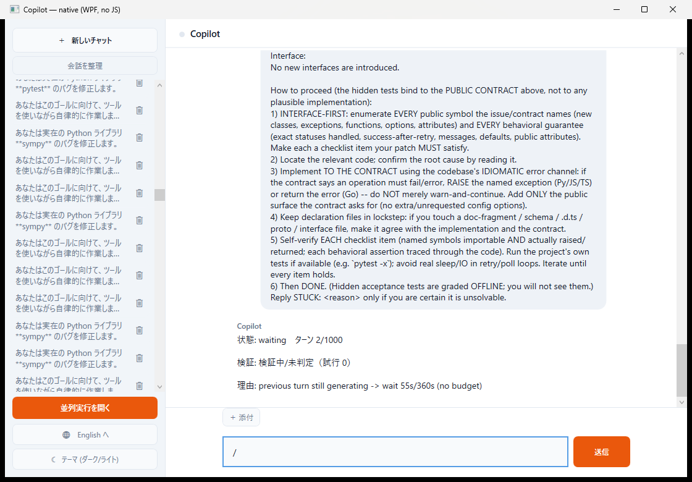
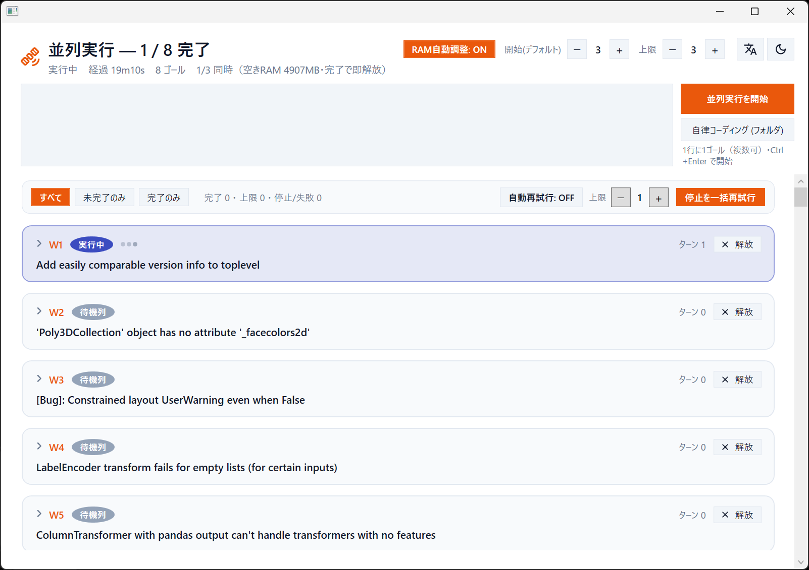

# m365-copilot-companion-mcp

## Getting started — まずこれだけ実行

- **初回（新しいPC）**: **`quickstart.bat`** をダブルクリック。Python+venv+依存の導入、`.env`(秘密の自動生成)、Dev Tunnel の設定、サーバ起動までワンクリックで通る。
- **毎日の起動**: **`start_all.bat`**（または quickstart が作るデスクトップアイコン）。冪等で、サーバ＋トンネル＋専用Edge＋bridge＋UI を一括起動。
- **健康診断**: **`doctor.bat`** ／ **エージェントURLの設定・変更**: **`configure_env.bat`** ／ **秘密の再発行（`.env` を漏らした時）**: **`rotate_secrets.bat`**。

ルートにある他の `.ps1`（`start_companion_edge.ps1`・`supervisor.ps1` 等）は、これらが内部的に呼ぶヘルパーです。**直接実行する必要はありません**。内部専用の小物は `scripts/win/` に隔離してあります。

## Current Benchmark Snapshot

- **SWE-bench Lite 300 strong scaffold (2026-06-20): 215/300 = 71.7% pass@1**.
  Wilson 95% CI: **[66.3%, 76.5%]**.
- **SWE-bench Verified fresh slice (2026-06-24): 153/200 = 76.5% pass@1**.
  Wilson 95% CI: **[70.2%, 81.8%]**. Fresh, non-burned instances (zero overlap with the 60 used
  for the Lite failure analysis), so this is a clean generalization check of the same scaffold on
  a different official set. The full 200-instance run is now graded: the final 38 completed on the
  rebuilt eval host (32 resolved, 5 unresolved, 1 empty patch counted as unresolved, 0 harness
  errors), so this is the complete run rather than a lower bound.
- Protocol: solve locally with the general strong scaffold, then grade each produced patch once
  with the official SWE-bench harness on kiyus. No hidden official-test feedback was fed back into
  the solve loop.
- The 85 misses were analyzed and folded back as adaptive, task-general quality cards shared by
  normal verified coding tasks and SWE-bench goals, rather than as a SWE-only prompt expansion.
- Recompute and details: `python bench/swe_lite300_scorecard.py` and
  `bench/SCORECARD_swebench_lite300_strong.md`.
- **GAIA validation, text-only (2026-06-25): 89/127 = 70.1%** (official GAIA scorer; L1 78.6% /
  L2 69.2% / L3 61.1%; 125/127 answered, 2 unrecovered). General-assistant benchmark, executed by the
  **M365 Copilot companion** via the `:8011` OpenAI-compatible endpoint, tool-augmented (map-mode:
  `run_python` for calculation, `web_search` for grounding) — **not** the Anthropic API direct. 38 of
  the 165 validation items need a file attachment the endpoint cannot receive and are excluded.
  Details under "GAIA" below.

> Microsoft 365 Copilot に **手** を生やすやつ。
> あなたの貸与ノート PC の上で動く。**100+ ツール**（執筆時点で 138）、
> 追加課金ゼロ、構築おおむね 1 人日。

🇯🇵 **このページは日本語版です。English version follows below ↓**

> **読むのがしんどい / 自分の環境で何が動くのか分からない場合**:
> この README 全文をコピーして、お使いの M365 Copilot か Claude に貼り付け、
> 「これは何で、自分の PC（OS・インストール済みアプリ）で実際に動くツールはどれ？」
> と聞いてください。AI のほうが、あなたの環境に合わせて噛み砕いてくれます。

---

## TL;DR

「M365 Copilot は Opus が中にいるのに、ファイルを読むくらいしかしてくれない」
を **物理的に** 解決する個人用 MCP サーバー。あなたの PC で動く Python サーバーが、Copilot に対して

- ファイルを読み・書き・整理する手
- Python を走らせる手（matplotlib でグラフも引ける）
- Excel / CSV / JSON を扱う手
- PowerPoint / Word / PDF を生成・読解する手
- ローカル / 社内の SQL を Windows 認証で叩く手
- バックグラウンドジョブを管理する手・スケジューラに登録する手
- そして **自分の出力を画像として読み返して自己検証する手**

を一式提供する。追加課金ゼロ、Microsoft 365 Copilot ライセンス内で完結。

```
[ M365 Copilot ]  ──▶  [ Copilot Studio エージェント ]  ──▶  [ Dev Tunnel ]
                                                                  ↓
                                  [ m365-copilot-companion-mcp on あなたのノート PC ]
                                                                  ↓
                                                  ファイル · Python · DB · Office 生成
```

> **ツール数について正直に**: `main.py` には 138 個のツールが収録されています（既定の
> map mode では最小コア＋`call_tool` ゲートウェイのみ MCP に登録し、残りはゲートウェイ
> 経由で呼べます）。ただし **クローン直後に全部が動くわけではありません**。Outlook 本体・PowerPoint・Tesseract・
> ODBC ドライバ・Windows 環境などを前提とするものが含まれます。**いま自分の環境で実際に
> 有効なツールは `list_my_tools` を叩けば分かります**。前提条件は下のカタログにタグで明記しています。

> **法的な但し書き**: 本リポジトリは Microsoft Corporation とは無関係です。
> "Microsoft 365", "Copilot", "Copilot Studio" は各社の商標であり、本書では
> この companion がどのプロダクトに接続するかを説明する目的でのみ言及しています。

---

## 📊 性能実測 — HumanEval 100%（全164問）

この companion を「自律コーディングエージェント」として **HumanEval（164問フル）** で実測した。採点は `bench/score.py` が各 `solution.py` に隠しテスト（canonical test）を再実行する **ground-truth**（モデルの自己申告ラベルではない真値）。

| 指標 | 値 |
|---|---|
| **pass@1（最終）** | **164 / 164 = 100%** |
| pass@1（first-pass） | 161 / 164 = 98.2%（Wilson 95% CI [94.8%, 99.4%]、n=164） |

- 頭脳は **M365 Copilot の中の Opus 4.8**。エージェントとして **複数ターンで自分のコードを `run_python` で実行・反復し、受入チェック（検証ゲート）を通し、一時的失敗は指数バックオフでリトライ** する。このスキャフォールド込みの数値。
- first-pass で外れた3問も、ゼロから再投入したら **3/3 解けて 100%**（決定的に不能な問題は無い）。
- **公平に**：Anthropic 公表の Opus 系 HumanEval（~90–92%）は **素のモデルの single-shot pass@1**。本数値は **エージェントループ＋自己テスト＋検証＋リトライ込み** なので直接比較はできない。**「頭脳が上」ではなく「スキャフォールドが効いている」**＝同じ Opus でも自走スキャフォールドを付ければこの水準に届く、という読み方が正しい（HumanEval 自体フロンティアには飽和ベンチ）。当初 3/20 まで落ちた大量停滞は純粋にハーネス信頼性の問題で、直列化→指数バックオフ→RAM 連動 autoscale→検証ゲートで天井まで回収した。

> 再現: `python -m bench.build --stride 1 --limit 164` → fleet で実行 → `python -m bench.score`。

---

## 📊 性能実測 — SWE-bench Lite 300（実OSS不具合修正・公式採点フル完走）

HumanEval が「関数単位の生成」なら、こちらは **実在 OSS のバグを隠しテストが通るまで直す** 実務に近い難タスク。SWE-bench Lite **300 件フル** を、**grader 非リーク**（解答中にエージェントが隠しテストを見ない＝`checks=N` で走らせ、採点はオフライン）・WSL2 Docker 上の **公式採点** でフル完走した。

- **SWE-bench Lite 300 フル：215 / 300 = 71.7% pass@1**（Wilson 95% CI [66.3%, 76.5%]・EVALERR 0・強化 scaffold）。
- **汎化の確認**：別の公式セット **SWE-bench Verified の非burned 200 件** でも **153 / 200 = 76.5%**（Wilson 95% CI [70.2%, 81.8%]）。Lite と無関係なインスタンスでの再現で、ベンチ過適合でないことを示す。
- 同じ Opus 4.8。HumanEval と同様、**「頭脳が上」ではなく「スキャフォールドが効いている」** ことを示す数値。

### どうやってここまで上げたか — クリーン60件での失敗分析（前段の診断ステップ）

300 へ進む前に、Lite の **1/5（60件）** で「ベースライン → 失敗分析 → 強化」の効果を測った。これが上の 300/200 を生んだ scaffold 強化の元になっている。

| 構成（60件スライス） | clean pass@1 |
|---|---|
| ベースライン scaffold | 40 / 59 = 67.8%（EVALERR 1件除外） |
| 強化 scaffold（失敗分析→根治） | 47 / 60 = 78.3%（EVALERR 0） |

- repo別（強化後）：django 20/23・matplotlib 5/5・scikit-learn 5/5・pytest 3/3・sympy 9/15・sphinx-doc 2/3。
- **スキャフォールドを強化すると上がる**：r1 の失敗を「検証ループ未閉鎖／多点修正の片肺／層違い／抑制vs表出」の故障クラスに類型化し、**ベンチに過適合しないドメイン一般な修正だけ** を投入（grader リークになる手は不採用）。狙った matplotlib(2/5→5/5)・sphinx(0/3→2/3) がピンポイントで改善。
- **誠実な注記**：60件の r1/r2 は別インスタンスなので +10.5pt にはインスタンス難易度のばらつきが混在（同一問題の統制比較ではない）。デバッグに使った問題は burned 扱いでスコア主張から除外。**この60件スライス(78.3%)がフル300(71.7%)より高いのは難易度差と小Nの揺れによるもので、過適合でない不偏値はフル300の71.7%** が代表値。

> 再現/詳細: `python bench/swe_lite300_scorecard.py`・`bench/SCORECARD_swebench_lite300_strong.md`。

---

## 📊 性能実測 — GAIA（一般アシスタント能力・公式採点）

HumanEval / SWE-bench は「コーディング力」。こちらは **GAIA**（Meta/HF の一般 AI アシスタント・ベンチ。Web 探索・多段推論・常識を要する実問題）で、companion の **一般事務／調査アシスタントとしての地力** を測った。重要なのは **解いたのは M365 Copilot エージェント本体**（Web グラウンディング有の既定 Copilot）であって **Anthropic API ではない** という点。採点は GAIA 公式スコアラ（正規化＋完全一致）で、自作テストではない。

| 指標 | 値 |
|---|---|
| **総合（text-only 127問）** | **89 / 127 = 70.1%** |
| Level 1 | 33 / 42 = 78.6% |
| Level 2 | 45 / 65 = 69.2% |
| Level 3 | 11 / 18 = 61.1% |
| 回答済み | 125 / 127（未回収 2 問） |

- **誠実な但し書き**：GAIA validation 165 問のうち **ファイル添付が必須の 38 問は除外**（:8011 エンドポイントはファイルを受け取れない）＝ text-only 127 問が対象。125 問回答済み、2 問は復旧不能なインフラ障害で未回収（誤答算入なら 89/127 = 70.1% のまま、未回収をミスとしても 89/127）。採点は GAIA 公式スコアラ（正規化＋完全一致）。
- **測定構成**：companion を `:8011` OpenAI 互換エンドポイント経由で駆動し、map-mode ツール（`run_python` による計算・`web_search` によるグラウンディング）を付与。Anthropic API 直叩きではない。
- **測定面の注意**：companion の relay は通常、ファイル操作用のカスタム Copilot Studio エージェントに固定されている。そのカスタムエージェントは設計上 **一般質問を断る**（「capital of France」すら拒否）ため、GAIA は **素の既定 Copilot（`/chat/`・Web 有）** に向けて測る。コーディング系の scaffold とは別系統の数値。
- **参考**：GAIA validation はトップ級エージェントでも text-only で概ね 40–70% 帯。70.1% は tool-augmented companion として外部比較可能な値。
- **この測定から生まれた恒久対策**：長寿命の単一会話だと Copilot の composer が数十ターンで送信不能（wedge）になり、1 問の生成固着が以降を連鎖エラーにする故障を確認。relay worker に **(1) 送信エラー時の会話リセット＋同一プロンプト1回再試行、(2) タイムアウト時は次問を強制リフレッシュ、(3) `RELAY_RESET_EVERY` 問ごとの予防的会話リサイクル** を実装（`relay/openai_adapter.py`）。インフラ起因のエラーは「誤答」に算入せず、チャンク毎に会話を作り直して回収する規律（`bench/gaia/retry_controller.py`）で正味スコアを確定した。

> 再現: 既定 Copilot に向けた `:8011` を立て、`python bench/gaia/runner.py`（公式スコアラ `bench/gaia/scorer.py`）。エラー回収は `python bench/gaia/retry_controller.py`。

---

## 🏆 こいつ、なにができるのか

「ファイル読むくらいしかしてくれない Copilot」を、**追加課金ゼロ・ライセンス内・ノート PC 1 台** でここまで盛りました。順に自慢します。

- **🧰 138 本の手足** — ファイル / Python / シェル / Excel / Word / PowerPoint / PDF / OCR / SQLite / 社内 DB(ODBC) / Outlook / スクショ / スケジューラ…。Copilot に「手」が無いなら生やせばいい、を地で行く。**しかも自分で新しいツールを書いて常設化できる**（tool foundry）。138 が床。
- **🤖 無人で回る中継器(relay)** — ゴールを 1 個渡すと、**あなたのキーボードを奪わずに** 裏で Copilot を完了まで自走させる（CDP 駆動）。停滞でも完了でも **デスクトップ通知**。Microsoft の自律エージェント（課金）を、ブラウザを行儀よく乗っ取って自前化した代物。
- **🔬 リサーチは Claude に投げる** — M365 の「リサーチ ツール」を **Anthropic / Claude にモデル切替** して deep research させ、結果を実装ループに合流（`RESEARCH:` と書くだけ）。**データ分析はアナリストに委譲** し、数値は自前ツールで地上検証（信じない、確かめる）。
- **🚀 小隊で並列** — 複数会話を 1 スレッドのラウンドロビンで並走（fleet）＋**絞られの兆候を検知して自動で速度を落とす適応スロットル**。干されない範囲で最大スループット。
- **🧾 説明できる・止められる** — 全ターンを監査ログ(operator D)に記録、要所で人間に確認(HITL ゲート)、kill-switch で即停止。「動いた証拠ゼロ」とは言わせない。
- **💬 Claude Code 風チャット UI を、Node ゼロ・Premium ゼロ・Direct Line ゼロで** — Premium が要ると言われた接続を、**ブラウザの応答を差分スクレイピング** して横取り。Python だけの SSE ブリッジ＋**Windows 同梱の .NET だけでビルドするネイティブ WPF アプリ**（マークダウン/コードブロック整形・ダーク/ライト・日本語/英語・会話履歴・コピー/停止）。別 PC の要件は **Python と Edge だけ**。下の[スクショ](#-ネイティブチャット-ui-python--edge-だけnode-不要)参照。
- **🛠 入れるのもワンクリック志向** — `setup.bat` が **管理者権限なしで Python を確保** し、途中で詰まったら「ここだけ手でやって再実行」で **中断→再開** できる冗長設計。

> 念のため正直に：このうち「Copilot を外から UI 駆動」「無料カスタム UI」あたりは **公式に用意された道ではなく、ブラウザを行儀よく乗っ取っているだけ** です。Microsoft が DOM を変えたら直すのはあなた。フェアユース天井もある。**そっちで何をやらかしてもこちらは知りません**（大事なことなので下にも書いてあります）。

> 競合の話：Microsoft 公式にも MCP 連携も「computer use」（UI 自動化・Claude Sonnet 4.5 対応）も **ある**。能力・堅牢性・スケールなら当然そっちが上で、本リポを軽々超える。だが本リポの身上は **「素のライセンスだけで・全部ローカルで・無人で・無料の自前 UI まで載せた組み合わせ」**。同じ形の OSS は探した範囲では見当たらなかった（GitHub Copilot のリバエンは沢山あるが、M365 Copilot をこの形で、はね）。

### 🆚 Frontier の「Cowork」と、正直どっちがいいのか

ここは茶化さずに書きます。**結論から言うと、自律実行という一点では公式の [Cowork](https://learn.microsoft.com/en-us/microsoft-365/copilot/cowork/) のほうが本物で堅い。** Cowork は Microsoft 公式の Frontier 機能で、長時間・複数ステップのタスクを Copilot 自身が遂行し（メール送信・会議設定・文書作成・Teams 投稿・予定管理）、**Work IQ** であなたの仕事の文脈を丸ごと把握し、Claude 製スキルも内蔵する。公式・サポート付き・管理者ガバナンス付き・モバイル/デスクトップ対応。**こちらの「ブラウザを乗っ取って無人ループさせる中継器」は、しょせん非公式ハックです。そこで見栄は張りません。**

そのうえで、本 companion が Cowork に **実際に勝てる軸は具体的にこれだけ** あります（誇張せず、事実だけ）:

| 軸 | Cowork (Frontier) | この companion |
|---|---|---|
| **入手性** | **Frontier プレビュー登録が前提**（組織がオン・枠次第） | **素の M365 Copilot ライセンスだけ**。Frontier が無くても／塞がれていても動く |
| **手の届く範囲** | M365 クラウド内（メール／予定／Teams／SharePoint／文書） | **あなたのローカル PC**：ファイル・ローカル Python 実行・社内 DB(ODBC)・シェル・ディスク上の Office 生成・スクショ。Cowork は原理的にローカルマシンには触れない |
| **透明性・拡張** | スキルは内蔵（固定・中身は見えない） | 全ツールが **読める・自分で書き足せる**（tool foundry）。全ターンが **監査ログ** に残り **kill-switch** で止まる。コードは全部あなたの手元 |
| **自前 UI** | M365 の画面 | Node も Premium も要らない **自前チャット UI** を好きに改造できる |

> 要するに、**クラウドで完結する高度な秘書仕事** なら Cowork が上。**自分のマシン・自分のデータ・自分のコードを動かしたい / Frontier が使えない環境でライセンスだけで何とかしたい / 全部自分で見て・書き換えて・止められることが要る**、なら companion に分がある。**どちらかではなく併用が一番賢い**——Cowork が来たらそっちに任せ、ローカルの手足だけここで足す、が現実解です。

> （筆者注：この companion は "公式の代わり" を名乗るものではありません。**公式が届かないローカル領域を、節度を持って・自己責任で埋めるための個人ツール** です。破壊的操作には毎回確認を挟み、削除は誤爆しない設計にし、できないことは「できない」と書く——そのつもりで作っています。）

---

## ⚠️ 会社の PC で動かす前に、まず深呼吸

これは **あなたが自分で所有・管理するマシン** で、**あなたが既にアクセス権を持っているデータ** に対して、**あなた個人の用途** で動かすツールです。SaaS でもホスティングサービスでもなく、サポート契約もありません。`m365-` で始まる名前は付いていますが、**Microsoft 製ではありません**。

以下のいずれか 1 つでも当てはまる組織なら、**会社のノート PC には絶対にデプロイしないでください**:

- 個人用 MCP サーバーの稼働が禁止されている
- Microsoft Dev Tunnels が承認されていない
- Copilot Studio のエージェントは IT 管理のテンプレートからしか作れない
- 任意の Python パッケージを会社 PC に入れることが禁止されている
- AI のツール実行・エージェントのファイルアクセス・サードパーティ GitHub クローンを「セキュリティインシデント」と扱う運用がある

該当するなら、本 README は **アイデアの参考** として読むだけにして、正式な社内承認を通したうえで類似のものを組むのが筋です。Bearer キーを会社の Copilot Studio にコピペして「バレないだろう」は、後で必ず痛い目を見ます。

ライセンスは **MIT**。**無保証・無責任・無サポート**。本リポジトリの作者・コントリビュータは、あなたが運用上やらかした事故に対して **一切の責任を負いません**。特に `MCP_UNLOCK_PASSWORD` の取り扱いには細心の注意を。

> ひとこと添えると: 「Cowork（社内導入された M365 系・Claude 系のエージェント基盤の総称）
> は禁止されたが、Microsoft の純正製品なら問題ないだろう」というロジックが通る職場であれば、
> 本ツールにも目はあります。ただし運用は必ず **明示的に承認を取る** ことを原則としてください。
> 「禁止されていない」≠「許可されている」を取り違えると、いずれ然るべきタイミングで然るべき方からお声がかかります。

---

## 🧱 設計思想 — どこまでがこの companion の仕事か

これが本リポを理解する一番の近道です。**役割分担を最初に頭に入れてください。**

```
┌─────────────────────────────────────────────────────────────┐
│  M365 クラウド側                                              │
│  メール送受信 / 予定表 / Teams 投稿 / SharePoint 検索 / Web 検索 │
│      ↑ これは Copilot Studio が公式に用意している「純正コネクタ」 │
│        を自分でオンにするのが本筋。認証も監査も Microsoft 管理。  │
├─────────────────────────────────────────────────────────────┤
│  あなたのローカル PC 側                                        │
│  ファイル / Python 実行 / ローカル・社内 DB / Office 生成 / シェル │
│      ↑ ここが「Copilot Studio のコネクタでは届かない領域」。     │
│        この MCP サーバーが担当するのは ここ。                    │
└─────────────────────────────────────────────────────────────┘
```

つまり本来の使い方は **「Copilot Studio の純正コネクタ（クラウド側）」＋「この companion（ローカル側）」の二枚重ね** です。メールやカレンダー、SharePoint をエージェントに触らせたいなら、まず Copilot Studio 側でその純正コネクタをオンにするのが正解。Microsoft が認証・監査を持ってくれるので、社内承認も通しやすい。

**では、なぜ本リポに `outlook_*`（メール/カレンダー）や `web_search` があるのか？**
これらは **「純正コネクタを設定できない／したくない環境向けの、ローカル退避路」** です。`outlook_*` は Graph API の登録なしに、いま PC にログインしている Outlook を COM 経由で借りるだけ。`web_search` も Copilot 標準の Web 検索が使えるなら不要です。**クラウド連携の本命ではなく、塞がれている時の代替手段** と理解してください。重複して見えるツールは、この事情によるものです。

迷ったら原則: **クラウドで完結する仕事は純正コネクタ、ローカル PC を触る仕事はこの companion。**

---

## 🎯 何ができるか

`main.py` の `TOOLS` タプルに登録された関数群が、すべて MCP ツールとして公開されます。LLM はツールごとの docstring を読んで、必要に応じて自分で選びます。実行中は `list_my_tools` で **いまの環境で有効な** カタログを引けます。

**前提タグの凡例**:
🟢 追加要件なし（Python 依存のみ、クローン後すぐ動く） /
🪟 Windows 専用 /
📦 追加インストールが必要（下の「前提」参照） /
☁ 実行すると外部サービスにデータが出る

| カテゴリ | 主なツール | 前提 | 何のために |
|---|---|---|---|
| **コード実行 (Python / shell)** | `run_python`, `shell_exec`, `run_python_in_background`, `run_in_background`, `job_wait`, `job_status`, `job_output`, `job_list`, `job_kill` | 🟢 | コードを走らせる、長いやつは投げて待つ、暴走したら殺す |
| **PowerShell 専用** | `pwsh_exec`, `pwsh_exec_file`, `shell_which` | 🪟 | `cmd.exe` 経由ではなく PowerShell 5.1 / 7 を直接叩く（`-NoProfile -NonInteractive -ExecutionPolicy Bypass` 込み） |
| **プロセス / サービス / レジストリ** | `process_list`, `process_info`, `process_kill`, `service_status`, `registry_read` | 🪟📦`psutil` | タスクマネージャ + サービス + レジストリの読み口（kill は unlock 必須） |
| **ファイル I/O** | `read_file`, `write_file`, `append_file`, `list_directory`, `glob`, `find_files`, `copy_path`, `move_path`, `trash_path`, `create_directory`, `delete_path` | 🟢 | 許可ディレクトリ内のファイルを自在に。`trash_path` はゴミ箱送りで復元可 |
| **ファイル/ディスク調査** | `hash_file`, `find_duplicates`, `dir_size`, `file_metadata` | 🟢 | ハッシュ・重複検出・容量・メタ情報。「80 GB どこいった？」を 1 プロンプトで。※ファイル“検索”は上の `glob` / `find_files`、本文検索は `grep` の方 |
| **編集・検索** | `grep`, `replace_in_file`, `multi_edit`, `diff_files`, `python_check` | 🟢 | 原子的な複数編集。「ファイル半分食われた」事故が起きない |
| **Git** | `git_status`, `git_diff`, `git_log`, `git_branch`, `git_blame`, `git_add`, `git_commit`, `git_checkout` | 📦`git` | 読みも書きも。`git_blame` でツッコむ相手を特定 |
| **表 / JSON** | `read_excel`, `write_excel`, `summarize_table`, `read_json`, `write_json` | 🟢 | Excel / CSV / JSON を一級市民として扱う |
| **PDF** | `read_pdf`, `pdf_info` | 🟢 | デジタル PDF のテキスト抽出 |
| **OCR** | `ocr_image`, `ocr_pdf` | 📦`Tesseract`（+`Poppler`） | スキャン画像/PDF の文字起こし。**read_image で Opus に直接読ませる手もある** |
| **画像（自己検証）** | `read_image`, `image_info` | 🟢 | エージェントが自分で作った図を **見返して** 確認できる |
| **PowerPoint** | `create_pptx`, `pptx_from_markdown`, `pptx_info`, `pptx_add_slide`, `pptx_add_image`, `pptx_add_table`, `pptx_replace_image` | 🟢 | スライド生成・画像/表埋込 |
| └ PNG 自己確認 | `pptx_export_png` | 🪟📦`PowerPoint 本体` | 各スライドを PNG 化してエージェントが目視 |
| **Word (.docx)** | `create_docx`, `docx_from_markdown`, `docx_info`, `read_docx` | 🟢 | 文書生成と読解。markdown 一発から正式文書まで |
| **Outlook (mail / calendar)** ※ローカル退避路 | `outlook_inbox`, `outlook_send_mail`, `outlook_calendar`, `outlook_create_event` | 🪟📦`Outlook 本体` | Graph コネクタが使えない時用。COM で今ログイン中の Outlook を借りる。送信は既定で「下書き保存」 |
| **クリップボード / スクリーン** | `clipboard_get`, `clipboard_set`, `screenshot` | 🪟 (screenshot は GUI セッション) | 「いまコピーしたこれ見て」「いま画面に映ってるもの撮って」 |
| **図 / 数式** | `render_diagram`(mermaid 等) ☁, `render_mermaid_png` ☁, `render_math` 🟢 | ☁`render_diagram`系は [Kroki](https://kroki.io) に送信 / `render_math` は外部不要 | アーキ図と数式を生成。**社外秘は render_diagram に出さない** |
| **Web** | `web_fetch`, `web_search`, `web_search_news`, `github_file` | ☁ | DuckDuckGo 検索・URL 取得。※Copilot 標準検索が使えれば不要 |
| **データベース (SQLite)** | `sqlite_tables`, `sqlite_schema`, `sqlite_query`, `sqlite_to_excel` | 🟢 | ローカル `.sqlite` を read-only で |
| **データベース (ODBC)** | `odbc_drivers`, `odbc_connections`, `odbc_tables`, `odbc_columns`, `odbc_query`, `odbc_to_excel` | 📦`ODBC ドライバ`+接続設定 | 社内 SQL Server / Azure SQL。Windows/Entra 認証継承、**read-only 強制** |
| **永続記憶** | `memory_save`, `memory_load`, `memory_list`, `memory_delete` | 🟢 | セッション横断のメモ。来週もエージェントが覚えてる |
| **スケジュール** | `schedule_create`, `schedule_list`, `schedule_info`, `schedule_run_now`, `schedule_delete` | 🪟 (タスクスケジューラ) | 「毎週金曜 9 時に週報生成」 |
| **ファイル監視** | `watcher_start`, `watcher_events`, `watcher_stop` | 📦`watchdog` | フォルダ変更検知 |
| **アーカイブ** | `zip_list`, `zip_extract`, `zip_create` | 🟢 | zip-slip 対策付き |
| **通知** | `notify_desktop` | 🪟 (トースト) | `job_wait` と組ませて「集計終わったよ」を能動通知 |
| **環境管理** | `env_info`, `pip_install`, `which`, `list_my_tools` | 🟢 | 実行環境の自己診断、足りないパッケージのその場 install |
| **セキュリティ** | `unlock`, `list_unlocked` | 🟢 | 変更系ツールの IP 単位パスワード解錠 |
| **その他** | `todo_write`, `todo_list`, `todo_clear` | 🟢 | エージェント自身の計画用スクラッチパッド |

> 「カタログに載ってるのに動かない」と感じたら、まず前提タグ（🪟 / 📦）を確認してください。
> 多くは依存をインストールするか Windows 上で動かせば解決します。どうしても要件を満たせない
> ツールは、その環境では単に使わなければよいだけで、他の 🟢 ツールには影響しません。

### ツールを増やすのは超簡単 — エージェント自身も増やせる

手動で増やす場合: `tools/*.py` に Python 関数を 1 つ書き、`main.py` の `TOOLS` タプルに追加して再起動するだけ。docstring が LLM の説明文になる。

そして本当に強力なのはここから。**エージェント自身が、その場で新しいツールを書けます**:

1. `pip_install` で必要なライブラリを入れる
2. `write_file` で `tools/your_ops.py` を生成する
3. `run_python` でロジックを動作確認する

——ここまでをチャットの中で完結できる。あとは `main.py` の `TOOLS` に 1 行足して再起動すれば、**自分で書いたツールが次回から常設ツールになる**。「◯◯の API を叩くツールが欲しい」と頼めば、エージェントが雛形を書いて検証し、登録手順まで提示します。つまりこのサーバーは **使いながら自分で育つ**。138 は出発点にすぎません。

---

## 🔁 自動リレー — Copilot を“裏で勝手に回す”（目玉機能）

ここがこのプロジェクトの一番尖った部分です。`relay/copilot_autopilot_relay.py` は、
**ゴールを1つ渡すと、あなたの M365 Copilot エージェントを自律的に完了まで駆動する**
スタンドアロンのコントローラ（中継器）です。

```
ゴール投入 ──▶ [ relay ] ──CDP──▶ [ Edge のあなたの Copilot タブ ]
                  ▲  完了検知して次を自動投入             │ MCP ツールで実作業
                  └───────────── 応答を読む ◀────────────┘
```

**何がすごいか:**

- **あなたの作業を一切邪魔しない。** ブラウザを Chrome DevTools Protocol 経由で
  駆動するため、**OS のマウスカーソルもキーボードフォーカスも奪いません**。
  relay が裏で Copilot 会話を回している間、あなたは別ウィンドウで普通に入力作業を
  続けられます。スクショ＋クリックの自動化（=画面を占有する）とは根本的に違います。
- **Claude も人間もループに不在。** 唯一の知能は Copilot エージェント自身（固定
  オラクル）。relay 側は「完了を検知して次の job を投げる」決定的な配管だけで、
  生成 AI を一切使いません。だから **完全無人で回り続けます**。
- **記録される。** 各ターンを **クロスセッション memory** と **監査ラン
  ログ（operator D）** の両方に保存。後から `runlog_summarize` で収束の軌跡を
  確認でき、次回の relay は前回の文脈を memory から引き継いで再開します。
- **止められる・問える。** `stop_request()`（kill-switch）を毎ターン＆長時間
  待機中もポーリング。HITL ゲートと組み合わせれば要所で人間に確認を取れます。
- **完了でも停滞でも必ず通知。** ゴール達成（DONE）・行き詰まり（STUCK）・
  上限到達（MAXTURNS）・中止（ABORTED）のいずれでも `notify_desktop` でデスクトップ
  通知。重いタスクを投げて別作業に戻り、終わった/止まった時だけ気づけます。
  停滞は「無進捗が続く・ターンがタイムアウト・エージェントが STUCK 申告」で自動検知。

> 制御ループの信頼性は `relay/test_relay_loop.py` で **全終了パスを検証済み**
> （DONE / 無進捗STUCK / FAIL→自己修復 / タイムアウトSTUCK / エージェントSTUCK /
> MAXTURNS / kill-switch の 7 シナリオ、各々で通知発火を確認）。ブラウザ無しで
> モックドライバにより決定的にテストできます。

**一回だけのセットアップ**（再ログイン不要・Playwright のブラウザ DL も不要 ―
既にログイン済みの Edge に attach するだけ）:

```powershell
.\.venv\Scripts\pip.exe install -r requirements-relay.txt

# Edge を debug ポート付きで起動（Chrome でも可）
& "C:\Program Files (x86)\Microsoft\Edge\Application\msedge.exe" --remote-debugging-port=9222
# → その Edge で M365 Copilot を開き、MCP エージェントで新規チャットを開始し、
#   会話 URL をコピー
#
# 【推奨】普段使いの Edge とは別の「専用・隔離 Edge」を使う:
#   .\start_companion_edge.ps1
# 別プロファイル(別 user-data-dir)＋固定ポートで起動するので、(1) debug ポートが
# 確実に bind し、(2) 本体 Edge に M365 タブを何枚開いても RAM を奪い合わず、本体の
# クラッシュに巻き込まれない。重い M365 タブ多数 → メモリ枯渇 → Edge 落ち →
# ポート 9222 消失、という並列実行の典型的な失敗をこれで断つ。SSO 済みなら無ログインで attach。

.\.venv\Scripts\python.exe relay\copilot_autopilot_relay.py `
  --conversation-url "https://m365.cloud.microsoft/chat/agent/.../conversation/..." `
  --goal "copilot_loop_demo に data.csv(10行)を作り、合計と平均を出す stats.py を書き、self-test を足して PASS させ、SUMMARY にまとめる" `
  --max-turns 12
```

> セレクタはライブの M365 Copilot DOM から採取済み（`COPILOT_SELECTORS` に隔離）。
> Microsoft が DOM を変えたらそこだけ直せば動きます。

---

## 🧑‍💻 自律コーディング・エージェント（Claude Code 相当 ＋ 本家に無い武器）

relay の上に、**Claude Code のような自律コーディング体験** を載せました。`relay/code_task.py` に
**自然言語で 1 行** 投げるだけ——`goals` ファイルもフラグも書かない:

```powershell
# 「このフォルダのバグを直して」だけ。検証方法は自分で判断して、通るまで完了しない
.\.venv\Scripts\python.exe -m relay.code_task -i "落ちてるテストを直して" -f C:\proj
```

**頭脳は M365 Copilot の中身＝Opus 4.8（Claude 本体と同じ）。** だから「生の知能」は Claude Code と
同等。違いは UI 駆動の信頼性だけ——そこを詰めて、機構としては Claude Code の **~80%** まで来ています。

**Claude Code と同じところ（catch-up 済み）:**

- **自然言語フロントドア** (`code_task`) — 「何をするか」だけ言えば、エージェントが必要なファイルを
  自分で探して編集。per-file の指示出しは不要。
- **🛡 検証ゲート（核心）** — Copilot が「DONE」と言っても**鵜呑みにせず、枠がローカルでテスト/コンパイル
  を実際に実行 **。通らなければ** 実際の失敗出力を突き返して **直させる。** テストが通るまで完了にしない**＝
  Claude Code の信頼性の本体。`relay/acceptance.py`。
- **🔎 検証の自動判定** — フォルダを見て **pytest があれば pytest、無ければ compile、Node なら npm test** を
  自動採用（`--check-cmd` 不要）。`relay/project_introspect.py`。
- **🗺 リポジトリ地図** — フォルダを AST 解析した「ツリー＋関数/クラスのシグネチャ＋docstring」を起点に
  注入。盲目 grep でなく **地図を持って着手**（aider/Claude Code 流）。`relay/repo_map.py`。
- **📝 プラン提示→承認→実行** — `--plan` で **まず番号付き計画を出して一時停止**（承認待ち）。あなたが
  **承認 or 編集を割り込み(steer)で送る** と実行開始。`relay/planner.py`。

**Claude Code に無い武器（差別化／ここで差を開く）:**

- **🧑‍⚖️ 多視点レビューパネル**（operator B）— 完了候補に対し、**正しさ／境界値／セキュリティの独立
  レビュアーを当てて多数決**。機械検証で捕まらない意味的欠陥を潰す。`--refuter`（単一）/`--panel`（3観点）。
  Claude Code に組み込みの敵対的レビューは無い。
- **🚀 N 本同時の並列フリート** — 複数ゴールを 1 スレッドで並走。Claude Code は基本 1 トラック。
- **🛠 ツールの自己生成**（operator A / foundry）— タスク中に `FORGE: <名前>` ＋ ```python``` で**再利用
  ツールを自作**。構文検証して `tools/auto/` に常設化。`--forge`。
- **🧾 全ターン監査ログ＋kill-switch、ツール使用トレース**（`MCP_TRACE_TOOLCALLS=1` で「何を編集/実行したか」
  を JSONL 記録）。
- **💴 コストが M365 ライセンス内**（従量課金の deep research と違い定額）。

**正直な天井**: UI（CDP/DOM/Edge）駆動なので、API 直叩きの Claude Code の堅牢性には **原理的に届かない**
（低 RAM 下の送信揺れ等）。そこは送信成功検知の強化・Edge の自動リサイクル（肥大/低RAMで起動前に
クリーン化）でかなり詰めました。**機構パリティ ~80%／実用 ~65%、いくつかの軸では本家超え**、が正直な現在地。

> これらの制御ロジックは **ブラウザ無しで決定的にテスト** しています（acceptance / 検証ゲート / 反証パネル /
> プラン承認 / forge / リサイクル等、**138 本超のユニットテスト**）。実機 Copilot 相手の end-to-end
> （バグ修正→pytest 検証→反証 UPHELD→DONE、計画提示→承認→実行）もライブで実証済み。

```powershell
# よく使う形
-m relay.code_task -i "バグ直して" -f C:\proj                    # 自然言語＋自動検証
-m relay.code_task -i "リファクタして" -f C:\proj --plan         # 計画提示→承認→実行
-m relay.code_task -i "堅牢化して"   -f C:\proj --panel          # 3観点レビューパネル
-m relay.fleet_runner --goals-file goals.txt --max-concurrent 3  # N 本並列
```

---

## 💬 ネイティブチャット UI（Python + Edge だけ・Node 不要）

Premium / Direct Line を使わず、Copilot エージェントを **手元のローカルアプリのように** 使える 2 つのフロントエンドを同梱しています。どちらも裏は同じ「ブリッジ → CDP → Copilot」経路で、別 PC の要件は **Python + Edge のみ**（Chrome も Node も不要）。

- **Python ブリッジ** (`bridge/copilot_bridge.py`): stdlib の `http.server` だけで自己完結の HTML チャットを配信し、Copilot の応答を **差分スクレイピングでトークン単位ストリーミング**。起動は `.\start_bridge.ps1` 推奨 → ブラウザで `http://127.0.0.1:8765`。これは bridge を **専用の隔離 Edge**（別プロファイル `copilot-bridge-edge` ＋別 CDP ポート `:9223`）で立てるので、SWE フリートの Edge（`:9222`）と取り合わず **フリート走行中でも同時に使える**（Edge は 1 プロファイル＝1 プロセスのため、並走には別プロファイル＋別ポートが必須）。単体で繋ぐなら `python bridge\copilot_bridge.py`（既定で `:9222` の Edge に attach）。
- **ネイティブ WPF アプリ** (`ui/CopilotChat.cs`): Windows 同梱の `csc.exe` だけでビルドする **完全 JS フリー** のデスクトップチャット。マークダウン/コードブロック整形・ダーク/ライト・日本語/英語切替・会話履歴サイドバー（リネーム・削除）。`ui\build_and_run.bat` でビルド＆起動。
- **フリートコックピット** (`ui/FleetCockpit.cs`): 並列実行を 1 ライブカード/ゴールで可視化。RAM 自動調整（適応スロットル）・disk/RAM 容量アウェアな連続アドミッション（重い eval は単独・軽い eval は並走）・完了で即タブ＆容量解放・各ワーカーを途中でステア/解放。`ui\build_cockpit.bat` でビルド＆起動。





---

## 🚀 セットアップ（あなた個人の PC で）

### 全体像：自動でやること ／ 人間が必ず手でやること

スクリプトが自動化するのは「ローカル側のすべて」です。人間が 1 回だけ手を動かす必要があるのは「Microsoft のクラウド側」だけです。

| 自動（スクリプトが回す） | 手作業（人間が 1 度だけ） |
|---|---|
| Python venv 作成・パッケージインストール | Microsoft アカウントへのサインイン＋MFA |
| `.env` へのランダム秘密生成 | Dev Tunnel の作成と初回ログイン |
| MCP サーバー起動（`start.ps1`） | Copilot Studio でのエージェント登録・MCP URL 貼り付け |
| Dev Tunnel の常時監視・自動復旧（`supervisor.ps1`） | Copilot Studio のエージェント画面で「接続を追加」 |
| 専用 Edge の起動・サインイン状態維持（`start_companion_edge.ps1`） | 専用 Edge プロファイルへの初回 M365 サインイン |
| WPF UI のビルド＆起動（`ui\rebuild_ui.ps1`） | — |

> 一度登録すれば、2 回目以降は **`start_all.bat` をダブルクリック**するだけ（サーバー＋トンネル＋専用 Edge＋bridge＋UI を冪等に一括起動。STEP 8 参照）。

#### クリックだけで進む流れ（初回）

`quickstart.bat` をダブルクリックすると、以下を**順にガイド**します。コマンド入力は不要、**手作業は STEP 5 の Copilot Studio だけ**です。

```
quickstart.bat（ダブルクリック）
  1. Python 環境を自動構築（uv で管理者不要・要ネット）
  2. Bearer トークン / アンロックパスワードを表示（.env 自動生成）   ← メモする
  3. git 更新確認（zip 配布で .git が無ければ自動スキップ）
  4. setup_devtunnel.ps1：CLI 導入(winget→直接DL) → サインイン(ブラウザ→device-code)
       → トンネル作成 → 公開 URL を表示                              ← サインインをポチポチ
  5. ★ここで一時停止★ Copilot Studio で MCP コネクタ登録＋エージェント作成（唯一の手作業）
  6. エージェント URL ダイアログが自動で開く → URL を貼って保存       ← コピペ
  7. start_all.bat 相当で全部起動（サーバー＋トンネル＋Edge×2＋bridge＋UI）
```

途中で別 PC・別ターミナルが要ることはありません。**全部 1 つの黒い窓＋ダイアログ＋サインイン画面**で完結します。

#### 何が・どこに保存されるか（重要）

「設定値」は全部 `.env` に集約されますが、「サインイン状態」は性質上 `.env` に入れられません（盗まれると困る認証情報なので、入れないのが正しい）。**別 PC に移すときは、設定は `.env` ごとコピーで済みますが、サインインは各 PC で 1 回ずつやり直し**になります。

| 保存先 | 中身 | 別 PC へ持ち運べる？ |
|---|---|---|
| **`.env`**（git 管理外） | `MCP_API_KEY` / `MCP_UNLOCK_PASSWORD`（秘密）、`MCP_*_AGENT_URL`（エージェント URL）、`MCP_TUNNEL_NAME` / `MCP_TUNNEL_URL`、ポート類 | ✅ ファイルをコピーすれば設定はそのまま |
| **専用 Edge プロファイル** `copilot-companion-edge`(:9222) / `copilot-bridge-edge`(:9223) | M365 への**サインイン状態（Cookie）** | ❌ 各 PC で初回 1 回サインイン |
| **devtunnel** のローカルトークン | Dev Tunnel への**ログイン状態** | ❌ 各 PC で 1 回 `setup_devtunnel.ps1`（サインイン） |
| **Copilot Studio**（クラウド） | エージェント本体・MCP コネクタ登録 | ☁ クラウド側に 1 個作れば全 PC 共通。URL を `.env` に貼るだけ |

> つまり **「設定は全部 env、サインインだけ各 PC で初回ポチポチ」**。クリーンインストールした Windows に USB の zip で入れても、**ネット接続と M365 Copilot ライセンスさえあれば**この手順でセットアップできます（Python は uv が管理者不要で入れ、devtunnel は直接 DL、WPF UI は Windows 同梱の `csc.exe` でビルド。`pip install -r requirements.txt` に必要パッケージは全部入っています）。

---

### STEP 0 ─ 前提条件を確認する

**確認すること**

- **Windows 10 / 11**（PowerShell 5.1 以上）が必要です。macOS / Linux では 🪟 タグのツール（PowerShell・プロセス操作・スケジューラ・通知・Outlook 等）は動きません。
- **Microsoft Edge** がインストールされていること（bridge / fleet の CDP 経路で使います）。
- **M365 Copilot ライセンス**があること（Copilot Studio 経路を使う場合）。ライセンスだけでは不十分で、次の3点が揃って初めて Copilot Studio 経路が通ります:
  1. **職場/学校アカウント**であること（Copilot Studio は法人テナント製品。個人の Microsoft アカウントや消費者向け「Copilot Pro」では不可）。
  2. その職場アカウントに **full M365 Copilot ライセンス**が付いていること（Copilot Studio とエージェント内 MCP サーバー利用に必要。Copilot Studio はこのライセンスに含まれます）。
  3. **テナント管理者がカスタム/MCP コネクタを許可**していること。Copilot Studio の MCP は Power Platform のコネクタ基盤を通り **DLP ポリシーの対象**なので、管理者が custom connector や `*.devtunnels.ms` エンドポイントをブロックしているとライセンスがあっても追加できません（**大企業の従業員ほど自社 IT に塞がれている**ことが多く、自分がテナント管理者の小規模環境の方が自由）。
  - **個人で使う／会社にブロックされている場合は** → **ローカル Claude Desktop 経路（STEP 5-A）**。devtunnel も Copilot ライセンスも不要で、Claude Desktop さえあれば誰でも使えます。
- **Python 3.10 以降**がインストールされているか、winget で入れられる環境であること（`setup.bat` が自動取得も試みます）。
- **Git**（クローン用。なければ ZIP でもセットアップは同じ手順で動きます）。
- **.NET Framework 4.x** が OS に入っていること（WPF UI ビルド用。`C:\Windows\Microsoft.NET\Framework64\v4.0.30319\csc.exe` が存在すれば OK。Windows 10/11 ではほぼ標準で入っています）。

任意（使いたいツールがある場合のみ）:
- **Tesseract OCR** + 言語データ（`ocr_*` 用。日本語なら `jpn.traineddata`。[UB-Mannheim ビルド](https://github.com/UB-Mannheim/tesseract/wiki)）
- **Poppler**（`ocr_pdf` 用、PATH に通す）
- **Microsoft PowerPoint 本体**（`pptx_export_png` の COM エクスポート用）
- **Microsoft Outlook 本体**（`outlook_*` 用）
- **ODBC Driver 18 for SQL Server**（`odbc_*` で社内 DB に繋ぐなら）

---

### STEP 1 ─ クローンして `quickstart.bat` をダブルクリックする

**クリックするファイル:** `quickstart.bat`（リポジトリ直下）

```powershell
git clone https://github.com/MasayukiTa/m365-copilot-companion-mcp.git
# エクスプローラーで quickstart.bat をダブルクリック（または PowerShell から実行）
```

> **git を使わない人（ZIP でダウンロードする）:** GitHub のページを開き → 緑色の「**Code**」ボタン → 「**Download ZIP**」→ ダウンロードした zip を**解凍**（右クリック →「**すべて展開**」）→ 展開したフォルダ内の `quickstart.bat` を**ダブルクリック**。以降は git 版と全く同じです（`.git` が無いので STEP 3 の更新確認は自動でスキップされます）。

> **quickstart 実行中に英語の質問が出たら、基本はそのまま `Enter` を押せば安全な既定が選ばれます。** 迷ったら Enter で問題ありません。

`quickstart.bat` は **最初の 1 回で全部をガイドする 7 ステップ**になっています。**Copilot Studio の設定（STEP 5）だけが手作業**で、それ以外はクリックとコピペだけで進みます。

1. **`setup.bat` で Python 環境をブートストラップ。** Python が無ければ `uv`（Astral）を自動取得し `.venv` を作り `requirements.txt` を入れる。管理者不要・再開可能。
2. **Bearer トークン／アンロックパスワードを表示**（`.env` 自動生成。既存は上書きしない）。Copilot Studio に貼るのでメモ。
3. **git 更新確認**（`fetch` のみ。zip 配布で `.git` が無ければ自動スキップ）。
4. **`setup_devtunnel.ps1` を実行**（devtunnel CLI を winget か直接DLで導入 → ブラウザ or device-code でサインイン → トンネル作成 → **公開 URL を表示**）。
5. **Copilot Studio（唯一の手作業・ここで一時停止）**: 表示された公開 URL ＋ Bearer トークンで MCP コネクタを登録し、companion エージェントを作成（README STEP 4／STEP 5）。作成したら任意キーで再開。
6. **エージェント URL ダイアログが自動で開く**（`configure_env.ps1`）。作ったエージェントの URL を貼って保存 → `.env` に反映。
7. **`start_all.ps1` でスタック全部を起動**（サーバー＋トンネル＋専用 Edge＋bridge＋UI）。

**人間がやること:** ② のメモ、④ のサインイン（Entra ID をポチポチ）、⑤ の Copilot Studio 手作業、⑥ の URL コピペ。**コマンド入力は不要**。

**うまくいった目安:** 最後に CopilotChat／FleetCockpit のウィンドウが開き、サーバーが待受。以降の日常起動は `start_all.bat` のダブルクリックだけ（STEP 8）。

> **クリーンな Windows / USB メモリの zip でも動くか:** 動きます。ローカル環境構築に必要なのは**インターネット接続**だけ（管理者権限も不要）。Python は `uv` が管理者不要で入れ、devtunnel は直接DLで入り、WPF UI は Windows 同梱の `csc.exe`（.NET Framework 4.x）でビルドするため、追加の手動インストールは不要です（`.git` が無い zip 配布でも STEP 3 の更新確認を飛ばして進みます）。ただし **Copilot Studio 経路を使うなら STEP 0 の前提**（職場アカウント＋full M365 Copilot ライセンス＋管理者がカスタム/MCP コネクタを許可）が必要です。**個人用途はローカル Claude Desktop 経路（STEP 5-A）**ならこれらすべて不要。
> **PowerShell 派**は `.\setup.ps1 -WithExternalTools`（Python＋devtunnel＋Tesseract）→ `.\configure_env.ps1` → `.\start_all.ps1` でも同じです。

---

### STEP 2 ─ エージェント URL を設定する（`configure_env.bat` のダイアログにコピペ）

**クリックするファイル:** `configure_env.bat`（リポジトリ直下をダブルクリック）

`.env` を手で編集する必要はありません。`configure_env.bat` を**ダブルクリックするとダイアログが開く**ので、各エージェントの URL を貼り付けて [保存] を押すと `.env` に反映されます（既存値は自動で前入力されるので、後から追加・修正も可）。

ダイアログの 4 欄:

| 欄 | env 変数 | 何の URL か | 既定値 |
|---|---|---|---|
| メイン エージェント **(必須)** | `MCP_IMPL_AGENT_URL` | チャット＆フリートが操作する主エージェント（テナント固有 `T_…`） | なし。**必ず貼る** |
| フリート用 (任意) | `MCP_FLEET_AGENT_URL` | 並列実行用。空ならメインと同じ | なし（=メイン） |
| リサーチ用 (任意) | `MCP_RESEARCHER_AGENT_URL` | `/research` が使う調査エージェント（Researcher `…dr_work`） | **内蔵・通常は空でOK** |
| アナリスト用 (任意) | `MCP_ANALYST_AGENT_URL` | `/analyze` が使う分析エージェント（Analyst `…diceberry`） | **内蔵・通常は空でOK** |

> **実質「メイン エージェント」だけ貼れば動きます。** リサーチ用とアナリスト用は Microsoft 第一者エージェント（全ユーザー共通の Researcher / Analyst）なので、コード側に既定 URL を内蔵しており**通常は設定不要**です。リサーチとアナリストは互いに**別 URL**（別エージェント）で、同じにはなりません。
>
> もし自分のテナントで既定 URL のエージェントが開けなかった場合は、`/research` や `/analyze` 実行時に**「このエージェントが開けませんでした。正しい URL を貼り付けてください」というダイアログが自動で開く**ので、M365 Copilot のアドレスバーの URL を貼れば `.env` に保存され、次回からそれが使われます（＝**既定値で試し、つながらなければダイアログ**）。

> `quickstart.bat`（STEP 1）の流れの中でも、Copilot Studio でエージェントを作った直後にこのダイアログが自動で開きます。まだ無い欄は空のままでよく、後から `configure_env.bat` で追加できます。

**エージェント URL の取り方:** ブラウザで M365 Copilot (`https://m365.cloud.microsoft/chat`) を開き、左サイドバーから対象エージェント（STEP 5 で作成）を選んでチャットを開始したときの **URL バーの URL** をコピーして、上記ダイアログの該当欄に貼り付けるだけ。

**各 env 変数の意味まとめ:**

| 変数 | 意味 | 人間が設定 |
|---|---|---|
| `MCP_API_KEY` | MCP サーバーへの Bearer 認証キー（read-only 系ツールに必要） | 自動生成。Copilot Studio に貼る（STEP 5） |
| `MCP_UNLOCK_PASSWORD` | 書込・実行系ツールの IP 単位ロック解除パスワード | 自動生成。エージェントから `unlock(password=...)` で使う |
| `MCP_ALLOWED_BASE` | エージェントがアクセスできるフォルダの上限（`~` = ホーム全体） | 任意で絞る |
| `MCP_IMPL_AGENT_URL` | bridge / fleet が駆動する Copilot エージェントの URL | 手動で貼る（STEP 5 後） |
| `MCP_FLEET_AGENT_URL` | fleet 専用エージェント URL（未指定なら `MCP_IMPL_AGENT_URL` を使用） | 任意 |
| `MCP_CDP_URL` | 専用 Edge の CDP エンドポイント（既定 `http://localhost:9222`） | 変更不要 |
| `MCP_BRIDGE_PORT` | ブリッジ UI のポート（既定 `8765`） | 変更不要 |
| `MCP_DB_<NAME>` | ODBC 接続文字列（社内 DB を使うなら追記） | 任意 |

> **`.env` に自動で書き込まれるキー（あなたは触らなくてよい）:** セットアップは `MCP_API_KEY`・`MCP_UNLOCK_PASSWORD`（`quickstart`/`setup` が乱数生成）、`MCP_UNLOCK_TTL_DAYS`・`MCP_ALLOWED_BASE`・`MCP_TOOL_MAP` 系（`MCP_TOOL_MAP`／`MCP_TOOL_MAP_MAX`。テンプレートからそのままコピー）を書き込みます。続いて Dev Tunnel ステップ（`setup_devtunnel.ps1`）が `MCP_TUNNEL_NAME`・`MCP_TUNNEL_URL` を、エージェント URL ダイアログ（`configure_env`）が `MCP_IMPL_AGENT_URL` などの各エージェント URL を追記します。**これら以外（bridge / relay / ODBC などの任意項目）は、あなたが自分で有効化するまで `.env` 内でコメントアウトされたまま**です。

---

### STEP 3 ─ Dev Tunnel を作成してサーバーをインターネットに公開する

> **ローカルの Claude Desktop だけに繋ぐ場合はこの STEP は不要です。** STEP 5-A の Claude Desktop 設定に進んでください。M365 Copilot Studio から繋ぐ場合のみ必要です。

**クリックするファイル / コマンド:** PowerShell で `.\setup_devtunnel.ps1`（管理者不要）

**自動でやること（`setup_devtunnel.ps1` が冪等に全部やる）:**
1. `devtunnel` CLI のインストール — **winget で入らなければ公式の直接ダウンロード**（`https://aka.ms/TunnelsCliDownload/win-x64`）に自動フォールバック（winget 不要）。
2. サインイン — **ブラウザが開かなければ device-code 方式**（`https://microsoft.com/devicelogin` にコードを入力）に自動フォールバック。**職場の Entra ID だけでなく、個人の Microsoft アカウント(MSA)・GitHub アカウントでもログイン可**（既定の `-e/--entra` フローが個人アカウントも受け付ける。GitHub は `devtunnel user login -g`）。既ログインはそのまま再利用。
3. Tunnel＋ポート 8000 の作成（anonymous・冪等。既存トンネルがあれば再利用）。
4. **公開 URL を画面に表示し、`.env` に `MCP_TUNNEL_NAME` / `MCP_TUNNEL_URL` を記録**。

```powershell
.\setup_devtunnel.ps1
# ブラウザが開かない / 開きたくない場合は device-code を強制:
.\setup_devtunnel.ps1 -DeviceCode
# 別名のトンネルにしたい場合:
.\setup_devtunnel.ps1 -TunnelName my-tunnel
```

**人間がやること:** 表示されたサインイン画面で職場（Entra ID）アカウントで認証するだけ。最後に表示される `https://<ランダム>-8000.<リージョン>.devtunnels.ms/` の **公開 URL をメモ**（次の STEP 4 で Copilot Studio に貼ります。`.env` の `MCP_TUNNEL_URL` にも入っています）。

**うまくいった目安:** スクリプト末尾に `Dev Tunnel READY. Public URL ...` と URL が表示される。以降の常時公開は `supervisor.ps1`（`start_all.bat`）が `devtunnel host` を自動管理します。

> **個人ユーザー（法人テナントが無い人）への注意:** devtunnel のログイン自体は上記のとおり**個人 Microsoft アカウントや GitHub でも通ります**。ただし **この STEP（Dev Tunnel）と STEP 4-5（Copilot Studio）は、M365 Copilot Studio に繋ぐためのもの**で、Copilot Studio とその第一者エージェント（Researcher / Analyst）の利用には **M365 Copilot の法人ライセンス（職場/学校テナント）が必須**です。個人アカウントでは devtunnel は通っても Copilot Studio で行き止まりになります。
>
> **個人で使うなら → ローカル Claude Desktop 経路（STEP 5-A）。** こちらは **devtunnel も Entra ID も一切不要**（`localhost` で MCP 接続）で、Claude Desktop さえあれば誰でも使えます。この STEP 3 と STEP 4 は丸ごと飛ばしてください。

> **トンネル名と URL は人ごとに違います。** `setup_devtunnel.ps1` は、フレッシュな PC では **`m365-copilot-companion`** という汎用名でトンネルを新規作成します（既にトンネルがあればそれを再利用、`-TunnelName foo` で任意名も可）。公開 URL の `https://<ランダム>-8000...` の**ランダム部分は devtunnel がトンネルごとに自動採番**するので、**あなた専用の URL** になります。名前と URL は**あなたの `.env`（git 管理外）**の `MCP_TUNNEL_NAME` / `MCP_TUNNEL_URL` に記録され、共有・コミットされません。`supervisor.ps1` は `.env` の `MCP_TUNNEL_NAME` を読んで自分のトンネルを host します（メンテナの `companion-mcp` 等が他人に出ることはありません）。

> 旧来の手動コマンド（参考。`setup_devtunnel.ps1` が失敗した時のフォールバック）:
> `winget install Microsoft.devtunnel` → `devtunnel user login -d` → `devtunnel create m365-copilot-companion --allow-anonymous` → `devtunnel port create m365-copilot-companion -p 8000 --protocol http` → `devtunnel host m365-copilot-companion`。**supervisor が動いている場合はサインイン前に止める**（devtunnel プロセス競合回避）。

**2 回目以降の自動化（supervisor）:** `supervisor.ps1` がポート 8000 とトンネルを監視し、落ちていれば自動で復旧します。常時起動させるには:

```powershell
# ログオン時に自動起動（スタートアップフォルダに登録）
$startup = [Environment]::GetFolderPath('Startup')
$root    = (Get-Location).Path
@"
Set sh = CreateObject("WScript.Shell")
sh.Run "powershell -NoProfile -ExecutionPolicy Bypass -WindowStyle Hidden -File ""$root\supervisor.ps1""", 0, False
"@ | Set-Content -Encoding ASCII (Join-Path $startup "start-companion-supervisor.vbs")
```

> `--allow-anonymous` でも安全な理由: サーバーが **Bearer API キー（`MCP_API_KEY`）** で認証しているため、URL を当てずっぽうで叩いた人・bot は即 401 になります。

---

### STEP 4 ─ Copilot Studio でエージェントに MCP ツールを登録する（最重要の手作業）

**アクセス先:** `https://copilotstudio.microsoft.com`

これが「②出てきた env 関連を Copilot Studio に登録する」の本体です。

**人間がやること（順番どおりにクリックする）:**

1. Copilot Studio にサインインし、対象の**エージェント**を開く（無ければ「**新しいエージェント**」で作成）。
2. エージェントの編集画面で「**ツール**」→「**ツールを追加**」（または「**新しいツール**」）をクリック。
3. タイルの選択画面（**プロンプト** / **エージェント フロー** / **コンピューターの使用** / **モデル コンテキスト プロトコル** / **カスタム コネクタ** / **REST API**）が出るので、「**モデル コンテキスト プロトコル**」を選ぶ。
4. ダイアログに以下を入力する（**サーバー名** / **サーバーの記述** / **サーバー URL** / **認証** の順に欄がある）。
   > 💡 **この値は手で組み立てなくてOK。`copilot_studio_values.bat` をダブルクリック**すると、あなたの `.env` ＋ Dev Tunnel から**実際の値をそのまま表示**します（quickstart の STEP 5 でも自動表示）。コピペするだけ。

   | 項目 | 入力値 |
   |---|---|
   | **サーバー名** | 任意（例: `companion`） |
   | **サーバーの記述** | 任意（空でも可） |
   | **サーバー URL** | `https://<your-tunnel>-8000.<region>.devtunnels.ms/mcp` （= `MCP_TUNNEL_URL` + `/mcp`） |
   | **認証** | 「**API キー**」を選ぶ（他に「なし」「OAuth 2.0」がある） |
   | **タイプ** | 「**ヘッダー**」を選ぶ（「クエリ」ではない。認証で「API キー」を選ぶと現れる） |
   | **ヘッダー名** | `Authorization` |
   | **API キーの値** | `Bearer <MCP_API_KEY の値>` （STEP 1 でコンソールに表示された値） |

   > ⚠️ **「API キーの値」欄には `Bearer ` という単語と半角スペースを含めて丸ごと貼ってください**（例: `Bearer 4baf1c2e...`）。UI のラベルが「API キー」なので生のキーだけを貼りがちですが、それだと 401 になります。`copilot_studio_values.bat` の出力はこの `Bearer ` 込みの行なので、その行をそのまま貼れば確実です。
   > （なお本サーバーは救済策として、`Bearer ` を付け忘れて生のキーだけを貼った場合でも認証が通るように内部で補正します。ただし迷ったら上記どおり `Bearer ` 込みで貼るのが正です。）

5. 「**作成**」をクリック → 接続がテストされ、ツール一覧がロードされれば成功。

6. 「**公開**」→「**利用者を自分だけ**」に設定（必ず自分のみ。組織全体は絶対に選ばない）。

**うまくいった目安:** ツール登録画面に `list_my_tools`, `read_file` などのツール名がずらっと表示される。

> ✅ **全部つながったか不安なら `doctor.bat` をダブルクリック。** サーバ→Dev Tunnel→専用 Edge→M365 サインイン→Bearer 認証まで**全リンクを緑/赤でチェック**し、赤には**その場で直し方**を表示します。「動いてる？」はこれ一発で解消できます。

**同時にやっておくと便利（任意）:** エージェントの「ツール」タブで、Copilot Studio の純正コネクタ（メール・予定表・Teams・SharePoint など）も有効化しておくと、クラウド側を純正コネクタ・ローカル側をこの companion、という本来の二枚重ねになります（→「🧱 設計思想」参照）。

**エージェント URL を `.env` に貼る（STEP 2 の続き）:**
登録が終わったらエージェントとチャットを開き、URL バーの URL を `MCP_IMPL_AGENT_URL` に貼って保存してください。MCP サーバーを再起動（`Ctrl+C` → `.\start.ps1`）すると反映されます。

---

### STEP 5 ─ 専用 Edge を起動して M365 に初回サインインする

**クリックするファイル:** `start_companion_edge.ps1`（リポジトリ直下）

```powershell
# 初回：可視ウィンドウで起動（サインイン操作が必要なため）
.\start_companion_edge.ps1

# 初回サインイン後は headless（ウィンドウなし）が推奨
.\start_companion_edge.ps1 -Headless
```

**スクリプトが自動でやること:**
- `copilot-companion-edge` という専用プロファイル（`%LOCALAPPDATA%\copilot-companion-edge`）でEdge を起動する。CDP（リモートデバッグポート）を `:9222` でバインドする。
- 普段使いの Edge とは完全に分離されるため、本体 Edge に M365 タブを何枚開いても RAM を奪い合わない。
- すでに同じポートが listen 中なら何もしない（多重起動防止）。

**人間がやること（初回 1 回のみ）:**
- `start_companion_edge.ps1` を `-Headless` なし（デフォルト）で実行すると Edge の可視ウィンドウが開く。
- そのウィンドウで `https://m365.cloud.microsoft/chat` が開くので、**職場 Microsoft アカウントでサインイン**する。
- SSO が有効（Azure AD 参加机）なら自動的にサインインが完了することもある。
- サインイン完了後、次回以降は `-Headless` で起動可（ウィンドウなし、タスクバーなし、完全バックグラウンド）。

**うまくいった目安:** コンソールに `Ready: CDP endpoint is up on http://127.0.0.1:9222` と表示される。ブラウザで `http://127.0.0.1:9222/json/version` にアクセスすると Edge の情報が返る。

**bridge 用の専用 Edge（bridge と fleet を同時に動かしたい場合）:**

```powershell
# bridge は別プロファイル (copilot-bridge-edge) + 別ポート (:9223) で起動する
.\start_bridge.ps1

# 初回サインインが必要なら
.\start_bridge.ps1 -SignIn

# bridge を常時稼働させたいなら（クラッシュ時も自動再起動）
.\start_bridge.ps1 -Keepalive
```

`start_bridge.ps1` は bridge 専用 Edge（`:9223`）を立て、`bridge\copilot_bridge.py` を起動します。`http://127.0.0.1:8765` にブラウザでアクセスすると、Node も Premium も不要なネイティブチャット UI が開きます。fleet の Edge（`:9222`）とは完全に別プロファイルなので、fleet 走行中でも同時に使えます。

---

### STEP 6 ─ WPF UI（チャット＋フリートコックピット）をビルドして起動する

**クリックするファイル:** `ui\rebuild_ui.ps1`（`ui` フォルダ内）

```powershell
# 止める・ビルドする・起動する、を一発で行う（推奨）
.\ui\rebuild_ui.ps1

# ビルドだけして起動しない場合
.\ui\rebuild_ui.ps1 -NoLaunch
```

**スクリプトが自動でやること:**
1. 起動中の `FleetCockpit.exe` と `CopilotChat.exe` を両方 Stop する（旧バイナリのロックを外すため）。
2. Windows に標準で入っている `C:\Windows\Microsoft.NET\Framework64\v4.0.30319\csc.exe`（.NET Framework 4.x の C# コンパイラ）で WPF アプリを 2 つビルドする:
   - `ui\FleetCockpit.exe` ─ 並列フリートの監視・制御コックピット
   - `ui\CopilotChat.exe` ─ マークダウン整形・ダーク/ライト・日本語/英語対応のチャット UI
3. ビルド成功後、両方を起動する。

**前提:** `.NET Framework 4.x` が必要（Windows 10/11 ではほぼ標準）。Visual Studio・.NET SDK・Node.js は不要。

> **旧スクリプトとの関係:** `ui\build_and_run.bat`（チャットのみ）と `ui\build_cockpit.bat`（コックピットのみ）は個別ビルド用の旧スクリプトです。`rebuild_ui.ps1` はこれら 2 つを正しい順序でビルドして両方を起動する「上位互換」スクリプトです。通常は `rebuild_ui.ps1` だけ使えば OK です。

**うまくいった目安:** `FleetCockpit.exe` と `CopilotChat.exe` の 2 つのウィンドウが開く。コンソールに `running FleetCockpit pid=... start=...` のような行が表示される。

---

### STEP 7 ─ 初回動作確認（接続テスト）

以下の順序で確認してください。

**① MCP サーバーが生きているか:**

```powershell
Test-NetConnection localhost -Port 8000
# TcpTestSucceeded : True が出れば OK
```

**② エージェントから `list_my_tools` を叩く:**

Copilot Studio のエージェント（または `CopilotChat.exe` UI）に次のように話しかける:

> 「`list_my_tools` を呼んで。」

ツール一覧が返れば配線 OK。🟢 のものはすぐ使えます。🪟 / 📦 のものは依存が揃っていない場合にエラーになりますが、サーバー全体は落ちません。

**③ 書込・実行系ツールのアンロック（初回のみ）:**

書込・実行系ツール（`write_file`, `run_python` 等）を初めて呼ぶと:

```
[locked client IP: '203.0.113.42'] Call unlock(password='...') first.
```

と言われます。エージェントに次を伝えてください:

> 「`unlock(password="<MCP_UNLOCK_PASSWORD>")` を呼んで。」

その IP が `MCP_UNLOCK_TTL_DAYS` 日間（既定 30 日）解錠されます。以降は同じ IP から呼ぶ限り再解錠不要です。

**④ Dev Tunnel を通る接続（Copilot Studio 経由の場合）:**

Copilot Studio のバックエンドから呼ぶと IP が毎回変わることがあります（`unlock` を再び要求される）。これは正常動作です。再度 `unlock` を呼べば OK です。

---

### STEP 8 ─ 2 回目以降の日常起動

**デスクトップの「M365 Companion」アイコンをダブルクリックするだけ**です（quickstart が初回に自動作成。中身は `start_all.bat`。リポジトリを探す必要なし）。これ 1 つで下記スタック全部を一括起動します:

| | 起動するもの | 既に動いていたら |
|---|---|---|
| 1 | `supervisor.ps1`（MCP サーバー＋Dev Tunnel host） | スキップ。**動いているトンネルは絶対に止めません** |
| 2 | 専用 Edge `:9222`（フリート／エージェント用・headless） | スキップ（ポートが応答していれば） |
| 3 | `start_bridge.ps1 -Keepalive`（bridge `:9223`＋チャット） | スキップ |
| 4 | `CopilotChat` / `FleetCockpit` ウィンドウ | スキップ |

`start_all.bat` は**冪等**です。全部が既に起動済みでも、セッション途中でも、何度ダブルクリックしても安全（先行プロセスは触らず、足りないものだけ補います）。初回 M365 サインインが必要な時だけ可視 Edge が出るので、そこでサインインしてください。

> 個別に起動したい場合は従来どおり: `.\supervisor.ps1`（サーバー＋トンネル）/ `.\start_companion_edge.ps1 -Headless`（`:9222`）/ `.\start_bridge.ps1 -Keepalive`（`:9223`）/ `.\ui\rebuild_ui.ps1`（UI をビルドし直して起動）。
> 初回セットアップ（venv・依存・`.env`・シークレット表示）は `quickstart.bat` のままです。`start_all.bat` はあくまで 2 回目以降の軽量ランチャー。

---

### STEP 5-A ─ Claude Desktop / Claude Code に繋ぐ場合（M365 なし）

Dev Tunnel（STEP 3）は不要です。`start.ps1` でサーバーを起動したら:

```json
{
  "mcpServers": {
    "companion": {
      "transport": "http",
      "url": "http://localhost:8000/mcp",
      "headers": { "Authorization": "Bearer <MCP_API_KEY の値>" }
    }
  }
}
```

を `~/.claude/claude_desktop_config.json`（Claude Desktop）または `.claude/settings.json`（Claude Code）に追記してください。

---

### よくある初期設定のトラブル

| 症状 | 確認・対処 |
|---|---|
| `quickstart.bat` が Python が見つからないと止まる | `winget install Python.Python.3.12` → 再実行 |
| `devtunnel login` が何度やっても "Not logged in" のまま | `supervisor.ps1` が動いていたら一度止める。フォアグラウンドの新しいターミナルで `devtunnel login` を実行し、ブラウザの「続行」を確実にクリックする（`docs/STARTUP_devtunnel_login.md` 参照） |
| Copilot Studio のツール登録でツール一覧が出ない | Dev Tunnel が `host` 状態かを確認（`devtunnel show m365-copilot-companion | Select-String "Host connections"`。`0` ならトンネルが落ちている）、MCP サーバーが起動しているか確認 |
| エージェントが「申し訳ございません。それに応答できませんでした。」と返す | MCP サーバーか Dev Tunnel が落ちている。`Test-NetConnection localhost -Port 8000` → `devtunnel show` → 手動で `.\start.ps1` → `devtunnel host` で復旧 |
| `rebuild_ui.ps1` が `csc.exe not found` で失敗 | .NET Framework 4.x が入っていない。「Windowsの機能の有効化または無効化」→「.NET Framework 4.8」を有効化 |
| `start_companion_edge.ps1` でサインインが要求され続ける | `-Foreground` でウィンドウを表示してサインインを完了させる → 次回から `-Headless` で起動 |
| `unlock` を何度も要求される | Copilot Studio バックエンドの送信元 IP が変わった（VPN 切替など）。その都度 `unlock(password=...)` を呼ぶのが正常動作 |

---

## 🔐 セキュリティモデル

3 層で重ねます。順に通過しないと先に進めません:

| 層 | 仕組み | 失敗時 |
|---|---|---|
| **認証** | 固定 Bearer トークン（`MCP_API_KEY`、40 桁のランダム hex） | 401 Unauthorized |
| **場所の認可** | 全ファイルアクセスは `_validate_path` を通過。`MCP_ALLOWED_BASE` 配下以外はブロック | `PermissionError` |
| **行為の認可** | 書込 / 実行系は `require_unlocked()` を呼ぶ。`X-Forwarded-For` か socket peer から取った IP をホワイトリストと突き合わせ（TTL あり） | "locked" メッセージで `unlock(password)` を要求 |

知っておくべきこと:

- unlock パスワードは API キーとは **別物**。どちらか片方の漏洩だけでは変更系は通せません
- `127.0.0.1` / `::1` は自動的に信頼（ローカル開発用）
- ODBC は `readonly=True` で接続、`SELECT / WITH / EXEC / SHOW / DESCRIBE` のみ許可
- DB 認証は Windows / Entra 統合認証なので、エージェントは **あなたの既存権限の範囲でしか SQL を投げられません**。DBA への新規アカウント申請は不要
- Bearer キーのローテーションは `.env` 編集 → 再起動だけ。古いキーは即死

これは **何ではないか**:

- ハードン済みのマルチテナントサービスではない
- ペネトレーションテスト済みではない
- あなたの PC を既に乗っ取った攻撃者からは何も守れない（その攻撃者は既にエージェントと同等以上の権限を持っている）
- 同僚に unlock パスワードを教えてしまうあなた自身からは守れない。**教えないでください**

---

## 🛟 キラーフィーチャー: 自己検証ループ

エージェント系の事故の大半は「完了したと言ったけど実は何もしていない」「画像が入っていない pptx を作って完了報告した」。本サーバーはエージェントが自分の出力を **見返す** ための 2 つのツールを持ちます:

- `read_image(path)`: PNG/JPG を base64 data URI として返す。Vision 対応モデル（M365 Copilot 内の Opus も含む）はそのまま読める
- `pptx_export_png(pptx_path)`: PowerPoint を COM 経由で起動し、各スライドを PNG にエクスポートする（🪟 PowerPoint 本体が必要）。`create_pptx` の後にこれを呼んで、エージェント自身が「画像が入っているか」「日本語が豆腐化していないか」を確認する

典型的な「Trust but Verify」ループ:

```
run_python       → chart.png を保存
read_image       → エージェントが目視確認、ズレてたら直す
create_pptx      → chart.png を report.pptx に埋め込む
pptx_export_png  → 各スライドの PNG をエージェントが流し見
notify_desktop   → 「report.pptx 完成」
```

system prompt にこの順序を 1 行入れておけば「画像なし pptx を完成と報告」事故は消えます。

---

## 📁 リポジトリ構成

```
m365-copilot-companion-mcp/
├── main.py                  # FastMCP のエントリポイント、ツール登録
├── start.ps1                # 起動スクリプト（.venv 自動検出）
├── requirements.txt
├── .env.example             # コピーして .env を作る
├── .gitignore               # 秘密・ランタイム状態・業務データを除外
├── LICENSE                  # MIT
│
├── tools/
│   ├── code_exec.py         # run_python, shell_exec
│   ├── shell_extra.py       # 🪟 pwsh_exec / pwsh_exec_file / shell_which
│   ├── jobs.py              # 非同期ジョブ管理
│   ├── process_ops.py       # 🪟 process_list / process_info / process_kill
│   ├── registry_ops.py      # 🪟 registry_read / service_status
│   ├── file_ops.py          # ファイル I/O + ディスク調査
│   ├── search_ops.py        # glob, find_files
│   ├── archive_ops.py       # zip 操作
│   ├── coding_ops.py        # grep, multi_edit, git_*, diff_files, python_check
│   ├── data_ops.py          # Excel / CSV / JSON
│   ├── pdf_ops.py           # PDF テキスト抽出
│   ├── ocr_ops.py           # 📦 Tesseract ラッパー
│   ├── image_ops.py         # read_image, image_info（自己検証）
│   ├── pptx_ops.py          # PowerPoint 生成（pptx_export_png は 🪟 COM）
│   ├── docx_ops.py          # Word (.docx) 生成・読解
│   ├── outlook_ops.py       # 🪟 Outlook COM（ローカル退避路）
│   ├── clipboard_ops.py     # クリップボード読み書き
│   ├── screenshot_ops.py    # 🪟 スクリーンキャプチャ
│   ├── diagram_ops.py       # ☁ Kroki ベースの図生成
│   ├── render_ops.py        # matplotlib mathtext の数式レンダラ
│   ├── web_ops.py           # ☁ web_fetch, github_file
│   ├── search_web.py        # ☁ DuckDuckGo 検索
│   ├── sql_ops.py           # SQLite（read-only）
│   ├── odbc_ops.py          # 📦 ODBC / SQL Server / Azure SQL
│   ├── schedule_ops.py      # 🪟 Windows タスクスケジューラ
│   ├── watcher_ops.py       # 📦 フォルダ監視（watchdog）
│   ├── memory_ops.py        # クロスセッション記憶
│   ├── notify_ops.py        # 🪟 Windows トースト
│   ├── env_ops.py           # env_info, pip_install, which
│   ├── task_ops.py          # todo_write / list / clear
│   ├── registry.py          # @register デコレータと list_my_tools
│   └── security.py          # unlock / require_unlocked / IP ホワイトリスト
│
└── agent_memory/            # 長期メモ（大半は git 除外）
    ├── README.md            # 追跡: スキーマ説明
    └── templates/           # 追跡: 空テンプレート
```

---

## 🧩 推奨システムプロンプト断片

Copilot Studio または Claude Desktop のエージェント instructions に貼り付け推奨:

```
あなたは companion の操作者。companion はユーザーの PC 上で動き、多数の
MCP ツールを公開している。

- 何が使えるか不明な時は最初に list_my_tools を呼ぶ。ツールが「依存が無い」
  エラーを返したら、ユーザーにその前提（OS/アプリ/ライブラリ）を伝えて代替手段を
  提案する。全部のツールがどの環境でも動くわけではない。
- 読取系は常に使える。書込・実行系は IP 単位で unlock(password) を必要とする。
  ロック解除を求められたらユーザーに 1 度だけ伝えればよい。
- クラウド側の作業（メール・予定表・Teams・SharePoint）は、可能なら Copilot Studio の
  純正コネクタを使う。この companion の outlook_* 等はコネクタが使えない時の代替路。
- 出力ファイルは原則 ~/Desktop/<案件名>/ 配下に保存する。
- 画像や PowerPoint を生成した直後は read_image / pptx_export_png で自己検証し、
  画像欠落・豆腐化・レイアウト崩れがあれば最大 3 回まで修正と再エクスポートをループする。
- 重い処理は run_python_in_background + job_wait で投げ、終わったら
  notify_desktop でユーザーに能動通知する。ユーザーをスピナーで待たせない。
- ユーザーや案件について長期的に役立つ情報を知ったら memory_save する。
  既出の話題には memory_load / memory_list で取りに行ってから回答する。
- 必要なツールが無ければ、pip_install + write_file + run_python で自作してよい。
  動作確認後、main.py の TOOLS への登録手順をユーザーに案内する。
- 機密データを外部サービス（Kroki, web_fetch 等）に流さない。迷ったらローカル処理。
```

---

## 🛠 トラブルシュート

> **🔌 まず最初に疑うこと — Copilot がこう言い出したら、ほぼ MCP/トンネル切れです:**
> 日本語: **「申し訳ございません。それに応答できませんでした。他に何かお手伝いできることはありますか?」**
> 英語: （同等の "Sorry, I couldn't respond to that…" 系。正確な文言は未確認）
>
> この文言が出たら、エージェントの故障ではなく **MCP サーバーか Dev Tunnel が落ちている**
> 可能性が高い。確認順:
> 1. ローカルでサーバー生存: `Test-NetConnection localhost -Port 8000`
> 2. トンネルが host 中か: `devtunnel show <tunnel> | Select-String "Host connections"`（**0 なら切れ**。プロセスは生きていても host 接続だけ落ちることがある）
> 3. supervisor が動いているか（下記「常時起動」参照）。動いていれば数十秒で自動復活する
> 4. 手動復旧: サーバー起動 → `devtunnel host <tunnel>`

### 常時起動 / 切断対策（supervisor）

Dev Tunnel の host 接続は、**プロセスが生きていても relay 接続だけが静かに落ちる** ことがあります
（これが上の Copilot エラーの主因）。同梱の `supervisor.ps1` は、ポート 8000 とトンネルの
`Host connections` を定期監視し、落ちていれば自動で張り直します（誤検知防止のデバウンス＋
接続確立待ち付き）。

手動で起動:

```powershell
powershell -NoProfile -WindowStyle Hidden -ExecutionPolicy Bypass `
  -File .\supervisor.ps1 -TunnelName <あなたのトンネル名>
```

**ログオンのたびに自動起動** させたい場合（管理者権限不要。Task Scheduler が組織ポリシーで
弾かれる環境でも通る方法）— **スタートアップ フォルダ** にランチャを置く:

```powershell
$startup = [Environment]::GetFolderPath('Startup')
$root = (Get-Location).Path
@"
Set sh = CreateObject("WScript.Shell")
sh.Run "powershell -NoProfile -ExecutionPolicy Bypass -WindowStyle Hidden -File ""$root\supervisor.ps1"" -TunnelName <あなたのトンネル名>", 0, False
"@ | Set-Content -Encoding ASCII (Join-Path $startup "start-companion-supervisor.vbs")
```

これで再起動・スリープ復帰後もログオン時に supervisor が立ち上がり、サーバー＋トンネルを
復活させます（多重起動は内部の mutex で防止）。

| 症状 | 対処 |
|---|---|
| ツール一覧に出るのに呼ぶとエラー | そのツールの前提タグ（🪟 / 📦）を確認。対応する OS / アプリ / ライブラリを入れるか、その環境では使わない |
| `odbc_*` が接続不可 | ODBC Driver 18 for SQL Server をインストール、`odbc_drivers` で確認 |
| `ocr_*` が空を返す | Tesseract と言語データ（`jpn.traineddata` 等）を入れて `which("tesseract")` で確認。または read_image で Opus に直接読ませる |
| `pptx_export_png` 失敗 | ホスト PC に Microsoft PowerPoint がインストールされている必要あり（COM 経由） |
| `outlook_*` 失敗 | ホストに Outlook 本体が必要。なければ Copilot Studio の純正メールコネクタ側でやる |
| `render_diagram` で SSL エラー | 社内プロキシが Kroki をブロック。CA bundle を直すか、本ツールを使わず matplotlib でローカル描画させる |
| Copilot Studio がタイムアウト | 1 リクエストの実質予算は ~90 秒。`run_in_background` → `job_wait` で分割 |
| `unlock` を何度も要求される | 呼び出し元 IP が変わった（VPN 切替、Copilot Studio バックエンドの hop）。再 unlock |

---

## 🇯🇵 よくある質問（日本企業で運用する人向け）

**Q. このツール、結局なにをしてくれるの？（Cowork との違いは？）**
A. 「🧱 設計思想」の役割分担がそのまま答えです。Cowork（社内導入された M365 系・Claude 系エージェントの総称）が **何を指すか・なぜ禁止になったか** は会社ごとに違います。この companion がやるのは **「あなたが使ってよい Copilot に、ローカル PC の手を足す」** こと。クラウドで完結する作業（メール・予定表・SharePoint）は Copilot Studio の純正コネクタに任せ、この companion は **Copilot のコネクタでは届かない自分の PC の中身**（ファイル・Python・ローカル DB・Office 生成）を担当します。

**Q. 情シスに何と説明すれば？**
A. 「自分の貸与 PC 上で動く個人ツールで、自分が既にアクセス権を持つローカルリソースにしかアクセスしません」が正確。`MCP_ALLOWED_BASE` で許可パスを絞っていること、ODBC は read-only で Windows 認証を継承していること、クラウド側は Microsoft 純正コネクタに寄せていることを併せて伝えると話が早い。それでも NG なら、潔く諦めましょう。

**Q. 上司に「これ何？」と聞かれた**
A. 冒頭の図と「🧱 設計思想」の二段重ねの図を見せて「Copilot に手を生やすやつ。クラウドは純正コネクタ、ローカル PC はこれ」で多くは伝わる。技術系の上司なら「Dev Tunnel で localhost に MCP」まで言えば終わり。事務系の上司なら「Excel の集計を Copilot に頼んだら本当にやってくれる」が刺さる。

**Q. 監査でバレないか？**
A. **バレます**。隠す前提で運用しないでください。Dev Tunnel のログは Microsoft に残り、Copilot Studio の操作履歴も残ります。最初から「会社の AI 活用の試行として、自分の PC で動かしている」と説明できる形で運用してください。

**Q. 同僚にも使わせたい**
A. それは「共有」「公開」になります。Copilot Studio のチャネル設定で「自分のみ」を外す前に、情シスとの会話を 1 度挟んでください。共有用途は本リポの想定範囲外です。

**Q. データが Microsoft に流れない？**
A. M365 Copilot のチャット内容と、エージェントが返した文字列は Microsoft の Copilot Studio に流れます。これはエージェントを Copilot Studio で動かす以上、避けようがありません。ローカルファイルの中身も、エージェントが回答に含めればそのままチャットに出ます。**取り扱い注意の情報は最初からエージェントに見せないこと**。`MCP_ALLOWED_BASE` を限定するのは、この事故を物理的に減らすための仕切りです。なお `render_diagram`（Kroki）や `web_fetch` は ☁ タグの通り外部に出るので、社外秘では使わないこと。

**Q. README の内容が難しい / 自分の環境で何が動くか分からない**
A. この README 全文をコピーして、お使いの M365 Copilot か Claude に貼り、「これは何で、自分の OS・インストール済みアプリで実際に動くツールはどれ？」と聞いてください。AI があなたの環境前提で噛み砕いてくれます。

**Q. 退職時はどうする？**
A. `.env` の API キーと unlock パスワードは破棄。Dev Tunnel と Copilot Studio エージェントは削除。`.unlock_state.json` `.memory_state.json` `.todo_state.json` `agent_memory/` 配下も削除。PC 返却時にこの掃除は必須です。

---

## 🤝 コントリビュート

PR や Issue 歓迎。お願い:

- ツールの docstring は短く具体的に。**LLM が読みます**、人間だけが読むわけではありません
- 変更系ツールは必ず `tools/security.py` の `require_unlocked()` をラップ
- ディスクアクセスは必ず `_validate_path` を通して `MCP_ALLOWED_BASE` を越えないように
- OS / アプリ / ライブラリの前提があるツールは、その旨を docstring と README カタログのタグに明記
- **絶対にコミットしないもの**: `.env`, `.unlock_state.json`, `.memory_state.json`, 業務データ。`.gitignore` で塞いであります、緩めないでください
- 新ツールが外部サービスを呼ぶ場合、何のデータがどこに出ていくか docstring に明記（☁ タグ）。運用者がオプトアウトできるように

## 📜 ライセンス

[MIT](./LICENSE)。自己責任で自由にどうぞ。上の警告を頭に置いたうえで。

---
---

# 🇺🇸 English version

> Microsoft 365 Copilot shipped you a brain. It forgot the hands.
> This is the hands.

A personal-use **Model Context Protocol (MCP) server** that turns one
laptop into a fully-capable agent backend for **Microsoft 365 Copilot**,
**Claude Desktop**, or any other MCP-aware client. **100+ tools** (138 at
the time of writing). Zero external API keys. Built in roughly a day.

> **If this README is long or you're not sure what runs on your machine**:
> copy the whole thing into your M365 Copilot or Claude and ask
> "what is this, and which tools actually work on my PC (my OS + installed
> apps)?" The model will tailor it to your environment.

The motivating frustration: corporate M365 Copilot licences come with
Claude Opus included, but Opus has no fingers. It can read what you
paste into the chat, and that's about it. This server gives the model
**real hands** on the one laptop where you have permission to do as you
please — your own.

```
[ M365 Copilot ]  ──▶  [ Copilot Studio agent ]  ──▶  [ Dev Tunnel ]
                                                            ↓
                                     [ m365-copilot-companion-mcp on your laptop ]
                                                            ↓
                                       your files · Python · DBs · Office gen
```

One user, one companion, one laptop. Nothing is centralised. Nothing
leaves the box you wouldn't want it to. Costs **zero** beyond the M365
Copilot licence you already have.

> **Honest note on the tool count**: `main.py` defines 138 tools (in the default
> map mode only a minimal core + the `call_tool` gateway are registered with the
> MCP client; the rest are reachable through the gateway), but
> **not all of them run on a fresh clone**. Some require Outlook,
> PowerPoint, Tesseract, an ODBC driver, or Windows. **Run `list_my_tools`
> to see what's actually live in your environment.** Requirements are
> tagged in the catalog below.

> Not affiliated with, endorsed by, or sponsored by Microsoft Corporation.
> "Microsoft 365", "Copilot", and "Copilot Studio" are trademarks of their
> respective owners; referenced only to describe what this attaches to.

---

## 📊 Measured performance — HumanEval 100% (all 164)

Run as an autonomous coding agent on the **full HumanEval suite (164 problems)**. Scoring is **ground truth**: `bench/score.py` re-runs each problem's hidden canonical test against the produced `solution.py` (not the model's self-reported label).

| Metric | Value |
|---|---|
| **pass@1 (final)** | **164 / 164 = 100%** |
| pass@1 (first pass) | 161 / 164 = 98.2% (Wilson 95% CI [94.8%, 99.4%], n=164) |

- The brain is **Opus 4.8 inside M365 Copilot**. As an agent it runs its own code via `run_python` across multiple turns, passes an acceptance/verification gate, and retries transient failures with exponential backoff — the figure includes that scaffolding.
- The 3 first-pass misses also passed when re-run from scratch — **3/3 → 100%** (nothing here is fundamentally unsolvable).
- **Fair framing:** Anthropic's published Opus HumanEval (~90–92%) is **raw single-shot pass@1**. This number is an **agentic loop + self-testing + verification + retry**, so it is *not* directly comparable — it shows the harness extracting the model's capability, not a smarter model (it *is* Opus). HumanEval is a saturated benchmark for frontier models. The earlier 3/20 mass-stall was purely harness reliability, recovered via serialization → exponential backoff → RAM-aware autoscale → verification gate.

> Reproduce: `python -m bench.build --stride 1 --limit 164` → run the fleet → `python -m bench.score`.

---

## 📊 Measured performance — SWE-bench Lite 300 (real-OSS bug fixing, full official run)

Where HumanEval is function-level generation, this is the near-real task: **fix a real OSS bug until the hidden tests pass.** We ran the **full SWE-bench Lite (300 instances)** with **no grader leakage** (the agent never sees the hidden tests while solving — `checks=N`, graded offline) under the **official SWE-bench harness** in WSL2 Docker.

- **SWE-bench Lite 300 full: 215 / 300 = 71.7% pass@1** (Wilson 95% CI [66.3%, 76.5%], 0 EVALERR, strengthened scaffold).
- **Generalization check:** on a *different* official set — **SWE-bench Verified, 200 non-burned instances** — it scores **153 / 200 = 76.5%** (Wilson 95% CI [70.2%, 81.8%]). Reproduced on instances unrelated to Lite, i.e. not benchmark overfitting.
- Same Opus 4.8 — like HumanEval, this shows the **harness extracting capability**, not a smarter model.

### How we got here — failure analysis on a clean 60 (the earlier diagnostic step)

Before scaling to 300, we measured "baseline → failure analysis → strengthened" on **1/5 of Lite (60 instances)**. This is what produced the scaffold strengthening behind the 300/200 above.

| Configuration (60-instance slice) | clean pass@1 |
|---|---|
| Baseline scaffold | 40 / 59 = 67.8% (1 EVALERR excluded) |
| Strengthened scaffold | 47 / 60 = 78.3% (0 EVALERR) |

- By repo (strengthened): django 20/23, matplotlib 5/5, scikit-learn 5/5, pytest 3/3, sympy 9/15, sphinx-doc 2/3.
- **The scaffold moves the number.** r1 failures were classed into failure modes (verification-loop-not-closed / partial-coupled-site / wrong-layer / suppress-vs-surface), and only **domain-general, non-overfit** fixes were applied (anything that would leak the grader was rejected). The targeted clusters — matplotlib (2/5→5/5), sphinx (0/3→2/3) — improved directly.
- **Honest caveat:** r1 and r2 are *different* instances, so the +10.5pt mixes scaffold gain with instance-difficulty variance (not a same-instance controlled A/B). Problems used while debugging are burned and excluded from any score claim. **The 60-slice (78.3%) being higher than the full 300 (71.7%) reflects difficulty variance and small-N noise; the unbiased, non-overfit figure is the full-300 71.7%.**

> Reproduce/details: `python bench/swe_lite300_scorecard.py`, `bench/SCORECARD_swebench_lite300_strong.md`.

---

## 📊 Measured performance — GAIA (general-assistant capability, official scoring)

HumanEval / SWE-bench measure coding. **GAIA** (Meta/HF's general AI-assistant benchmark — real tasks needing web search, multi-step reasoning, common sense) measures the companion's chops as a **general office/research assistant**. The key point: the work was done by the **M365 Copilot agent itself** (web-grounded default Copilot), **not** the Anthropic API. Scored with the **official GAIA scorer** (normalize + exact match), not a home-grown test.

| Metric | Value |
|---|---|
| **Overall (126 text-only)** | **66 / 126 = 52.4%** (Wilson 95% CI [43.7%, 60.9%]) |
| Level 1 | 26 / 42 = 61.9% |
| Level 2 | 33 / 65 = 50.8% |
| Level 3 | 7 / 19 = 36.8% |

- **Honest caveats:** of the 165 validation items, **38 require a file attachment the endpoint can't receive and are excluded** → 127 text-only are in scope; 1 more was an unrecovered infra timeout (66/127 = 52.0% if counted as a miss).
- **What surface is measured:** the companion's relay is normally pinned inside a file-ops custom Copilot Studio agent, which by design **declines general questions** (even "capital of France"). GAIA is therefore run against the **bare default Copilot (`/chat/`, web-grounded)** — a different track from the coding scaffold.
- **Reference:** GAIA validation lands roughly 40–65% text-only even for frontier agents; 52.4% is a credible, externally-comparable figure for a web-grounded Copilot.
- **Hardening this run produced:** a single long-lived conversation wedges Copilot's composer after dozens of turns, so one stuck generation cascades into errors on every later question. The relay worker now does **(1) conversation reset + one same-prompt retry on a send error, (2) forced refresh of the *next* job after a timeout, (3) proactive conversation recycle every `RELAY_RESET_EVERY` jobs** (`relay/openai_adapter.py`). Infra errors are never counted as wrong answers; they're recovered by rebuilding the conversation per chunk (`bench/gaia/retry_controller.py`).

> Reproduce: point `:8011` at the default Copilot and run `python bench/gaia/runner.py` (official scorer `bench/gaia/scorer.py`); recover infra errors with `python bench/gaia/retry_controller.py`.

---

## 🏆 What this thing actually pulls off

The "Copilot that only reads files" gets dragged this far on **zero extra
spend, inside the licence you already have, on one laptop.** Bragging, in
order:

- **🧰 138 hands and feet** — files / Python / shell / Excel / Word /
  PowerPoint / PDF / OCR / SQLite / corporate DB (ODBC) / Outlook /
  screenshots / scheduler… If Copilot has no hands, grow it some. **And you
  can write your own new tools and make them permanent** (the tool foundry).
  138 is the floor.
- **🤖 A relay that runs unattended** — hand it one goal and it drives your
  Copilot agent to completion in the background (over CDP) **without
  stealing your keyboard**. Desktop notification whether it finishes or
  stalls. It's Microsoft's paid autonomous-agent idea, rebuilt for free by
  politely hijacking a browser tab.
- **🔬 Research is delegated to Claude** — flip M365's "Research" tool over to
  **Anthropic / Claude** to run deep research, then merge the result back into
  the build loop (just write `RESEARCH:`). **Analysis is delegated to the
  Analyst**, and the numbers get re-checked on the ground with our own tools
  (don't trust — verify).
- **🚀 A small fleet in parallel** — several conversations driven round-robin
  on one thread (fleet) **plus an adaptive throttle that detects the early
  signs of being rate-limited and slows itself down**. Maximum throughput
  short of getting cut off.
- **🧾 Explainable and stoppable** — every turn lands in an audit log
  (operator D), a human is asked at the checkpoints that matter (HITL gate),
  and a kill-switch stops it dead. Nobody gets to say "no evidence it ran."
- **💬 A Claude-Code-style chat UI with zero Node, zero Premium, zero Direct
  Line** — a connection you were told needs Premium, intercepted by
  **differentially scraping the browser's response**. A Python-only streaming
  bridge **plus a native WPF app built with nothing but the .NET that ships
  with Windows** (markdown / code-block rendering, dark/light, JP/EN, history,
  copy/stop). All another PC needs is **Python and Edge**. See the
  [screenshot](#-native-chat-ui-python--edge-only-no-node) below.
- **🛠 One-click-ish to install too** — `setup.bat` **secures a Python without
  admin rights**, and if it jams partway it tells you "do just this bit by
  hand and re-run," so the bootstrap is **resumable** rather than all-or-nothing.

> In fairness: the "drive Copilot from outside" and "free custom UI" parts are
> **not an officially sanctioned path — they just politely hijack a browser**.
> If Microsoft changes the DOM, fixing it is on you. There's a fair-use
> ceiling too. **Whatever you blow up over there is not our problem** (it's
> important enough that it's written below as well).

> On the competition: Microsoft officially has both MCP integration and
> "computer use" (UI automation, Claude Sonnet 4.5 support). On capability,
> robustness, and scale theirs is naturally ahead and outclasses this repo
> handily. But this repo's whole pitch is **"the combination — plain licence
> only, all local, fully unattended, with a free homegrown UI on top."** As
> far as I looked, no OSS in this exact shape exists (plenty of GitHub Copilot
> reverse-engineering, but not M365 Copilot done this way).

### 🆚 Frontier's "Cowork" — which is honestly better?

No jokes in this section. **Bottom line up front: on the single axis of
autonomous execution, the official [Cowork](https://learn.microsoft.com/en-us/microsoft-365/copilot/cowork/)
is the real, sturdy thing.** Cowork is Microsoft's official Frontier feature:
Copilot itself carries out long, multi-step tasks (sending mail, setting up
meetings, drafting documents, posting to Teams, managing schedules), grasps
the whole context of your work through **Work IQ**, and ships with built-in
Claude-made skills. Official, supported, with admin governance, on mobile and
desktop. **This "hijack-a-browser-and-loop-it-unattended" relay is, at the
end of the day, an unofficial hack. No bravado here.**

That said, the few axes where this companion **genuinely beats** Cowork are
specifically these (no exaggeration, just facts):

| Axis | Cowork (Frontier) | This companion |
|---|---|---|
| **Availability** | **Requires Frontier preview enrollment** (org must turn it on, subject to seats) | **Just a plain M365 Copilot licence.** Works even when Frontier is absent or blocked |
| **Reach** | Inside the M365 cloud (mail / calendar / Teams / SharePoint / docs) | **Your local PC**: files, local Python execution, corporate DB (ODBC), shell, Office generation on disk, screenshots. Cowork fundamentally can't touch your local machine |
| **Transparency / extensibility** | Skills are built in (fixed, contents not visible) | Every tool is **readable and self-extensible** (tool foundry). Every turn lands in an **audit log** and a **kill-switch** stops it. The code is all in your hands |
| **Custom UI** | The M365 screen | A **custom chat UI** that needs neither Node nor Premium, hackable however you like |

> In short: for **advanced assistant work that lives entirely in the cloud**,
> Cowork wins. For **running your own machine, your own data, your own code /
> getting by on just a licence where Frontier isn't available / needing to see,
> rewrite, and stop everything yourself**, the companion has the edge. **The
> smartest move isn't either-or — it's using both**: when Cowork shows up, hand
> it the cloud work and just add the local hands here. That's the realistic
> answer.

> (Author's note: this companion does not claim to be a "replacement for the
> official thing." It's **a personal tool for filling the local gaps the
> official products can't reach — with restraint, at your own
> responsibility.** Destructive operations always get a confirmation, deletes
> are designed not to misfire, and what it can't do is written down as "can't."
> That's the intent.)

---

## ⚠️ Before you go any further

This is a thing you run **on a machine you control**, against accounts
and data **you already have permission to touch**, for **your own use**.
It is not a SaaS, not a hosted service, no support contract, and the
friendly Microsoft-flavoured name does not change that.

If your employer blocks personal MCP servers, hasn't approved Dev
Tunnels, restricts Copilot Studio agents to IT-managed templates, forbids
arbitrary pip installs, or treats AI tool execution / agent file access /
third-party GitHub clones as a security incident — **do not deploy this on
a company laptop.** Read it for ideas, build your own through proper
channels.

The licence is MIT. No warranty, no obligation, no liability.
**Whatever you blow up on your side is your problem.** Mind the unlock
password.

---

## 🧱 Design philosophy — where this companion's job ends

This is the fastest way to understand the repo. **Keep the split in mind:**

```
┌─────────────────────────────────────────────────────────────┐
│  M365 cloud side                                              │
│  mail / calendar / Teams posts / SharePoint search / web      │
│      ↑ Turn on Copilot Studio's own first-party CONNECTORS.   │
│        Microsoft owns the auth and the audit trail.           │
├─────────────────────────────────────────────────────────────┤
│  Your local PC side                                           │
│  files / Python exec / local & corporate DBs / Office gen /   │
│  shell                                                        │
│      ↑ The part Copilot Studio connectors can't reach.        │
│        THIS is what the MCP server is for.                    │
└─────────────────────────────────────────────────────────────┘
```

The intended setup is **both layers stacked**: first-party connectors for
the cloud, this companion for the local box. If you want the agent to
touch mail, calendar, or SharePoint, the right move is to enable Copilot
Studio's native connector for it — Microsoft handles auth and audit, which
also makes it easier to get past IT.

**Then why does this repo ship `outlook_*` and `web_search`?** They are
**local fallbacks for when you can't or don't want to set up the native
connector.** `outlook_*` borrows the already-signed-in Outlook over COM,
no Graph registration. `web_search` is unnecessary if Copilot's built-in
web search is available. They are escape hatches, not the primary path.
That's why some tools look redundant with Microsoft's connectors.

Rule of thumb: **cloud-only work → native connector; touching your local
PC → this companion.**

---

## 🎯 What this thing can do

`main.py` registers a flat catalog. Call `list_my_tools` at runtime to see
what's **live in your environment**.

**Requirement legend:**
🟢 no extra requirement (Python deps only, works right after clone) /
🪟 Windows-only /
📦 needs an extra install (see Prereqs) /
☁ sends data to an external service when used

| Category | Tools | Req. | What it's for |
|---|---|---|---|
| **Code execution** | `run_python`, `shell_exec`, `run_python_in_background`, `run_in_background`, `job_wait`, `job_status`, `job_output`, `job_list`, `job_kill` | 🟢 | Run code. Wait. Kill the runaway. |
| **PowerShell** | `pwsh_exec`, `pwsh_exec_file`, `shell_which` | 🪟 | Dedicated PowerShell with `-NoProfile -NonInteractive -ExecutionPolicy Bypass` defaults. |
| **Processes / services / registry** | `process_list`, `process_info`, `process_kill`, `service_status`, `registry_read` | 🪟📦`psutil` | Task Manager + Services + Registry, read-side (kill needs unlock). |
| **File I/O** | `read_file`, `write_file`, `append_file`, `list_directory`, `glob`, `find_files`, `copy_path`, `move_path`, `trash_path`, `create_directory`, `delete_path` | 🟢 | Read, write, move, delete inside the allowed base. |
| **File & disk inspection** | `hash_file`, `find_duplicates`, `dir_size`, `file_metadata` | 🟢 | Hashes, duplicate detection, disk usage, metadata. "Where did 80 GB go?" in one prompt. (File *search* is `glob`/`find_files`; text search is `grep`.) |
| **Editing / search** | `grep`, `replace_in_file`, `multi_edit`, `diff_files`, `python_check` | 🟢 | Atomic multi-edit. |
| **Git** | `git_status`, `git_diff`, `git_log`, `git_branch`, `git_blame`, `git_add`, `git_commit`, `git_checkout` | 📦`git` | Reads and writes. |
| **Tabular / JSON** | `read_excel`, `write_excel`, `summarize_table`, `read_json`, `write_json` | 🟢 | First-class spreadsheet handling. |
| **PDF** | `read_pdf`, `pdf_info` | 🟢 | Digital PDF text extraction. |
| **OCR** | `ocr_image`, `ocr_pdf` | 📦`Tesseract`(+`Poppler`) | Scanned docs. Or just `read_image` and let Opus read it. |
| **Image (self-verify)** | `read_image`, `image_info` | 🟢 | The agent sees what it made. |
| **PowerPoint** | `create_pptx`, `pptx_from_markdown`, `pptx_info`, `pptx_add_slide`, `pptx_add_image`, `pptx_add_table`, `pptx_replace_image` | 🟢 | Build decks, embed charts/tables. |
| └ PNG self-check | `pptx_export_png` | 🪟📦`PowerPoint` | Render each slide to PNG to audit. |
| **Word (.docx)** | `create_docx`, `docx_from_markdown`, `docx_info`, `read_docx` | 🟢 | Author and read Word docs. |
| **Outlook** *(local fallback)* | `outlook_inbox`, `outlook_send_mail`, `outlook_calendar`, `outlook_create_event` | 🪟📦`Outlook` | For when the Graph connector isn't set up. COM over the signed-in Outlook. Sends to Drafts by default. |
| **Clipboard / screen** | `clipboard_get`, `clipboard_set`, `screenshot` | 🪟 (screenshot: GUI session) | "Look at what I just copied / what's on screen." |
| **Diagrams / math** | `render_diagram`☁, `render_mermaid_png`☁, `render_math`🟢 | ☁ (Kroki) / `render_math` local | Don't send confidential content to `render_diagram`. |
| **Web** | `web_fetch`, `web_search`, `web_search_news`, `github_file` | ☁ | DuckDuckGo + URL fetch. Skip if Copilot's own search works. |
| **DB (SQLite)** | `sqlite_tables`, `sqlite_schema`, `sqlite_query`, `sqlite_to_excel` | 🟢 | Local `.sqlite`, read-only. |
| **DB (ODBC)** | `odbc_drivers`, `odbc_connections`, `odbc_tables`, `odbc_columns`, `odbc_query`, `odbc_to_excel` | 📦 driver + config | Corporate SQL Server / Azure SQL. Windows/Entra auth, read-only. |
| **Persistent memory** | `memory_save`, `memory_load`, `memory_list`, `memory_delete` | 🟢 | Cross-session notes. |
| **Scheduling** | `schedule_create`, `schedule_list`, `schedule_info`, `schedule_run_now`, `schedule_delete` | 🪟 | "Every Friday at 9, regenerate the report." |
| **File watching** | `watcher_start`, `watcher_events`, `watcher_stop` | 📦`watchdog` | React to folder changes. |
| **Archives** | `zip_list`, `zip_extract`, `zip_create` | 🟢 | zip-slip protected. |
| **Notifications** | `notify_desktop` | 🪟 | Windows toast; pair with `job_wait`. |
| **Environment** | `env_info`, `pip_install`, `which`, `list_my_tools` | 🟢 | Introspect host; install deps on the fly. |
| **Security** | `unlock`, `list_unlocked` | 🟢 | Per-IP unlock for mutating tools. |
| **Misc** | `todo_write`, `todo_list`, `todo_clear` | 🟢 | Agent's planning scratchpad. |

> If a tool shows up but errors when called, check its requirement tag
> (🪟 / 📦) first. Install the dependency or run on Windows — or just don't
> use it in that environment. The 🟢 tools are unaffected.

### Extending it is trivial — and the agent can do it itself

Manual route: write a Python function in `tools/*.py`, add it to the
`TOOLS` tuple in `main.py`, restart. The docstring becomes the LLM's
description.

The powerful part: **the agent can author new tools on the fly.**
`pip_install` the library, `write_file` a new `tools/your_ops.py`,
`run_python` to test it — all inside the chat. Add one line to `TOOLS`,
restart, and the tool it just wrote becomes permanent. Ask "I want a tool
that calls X's API" and it'll scaffold, test, and hand you the
registration step. The server **grows as you use it.** 138 is the floor.

---

## 🔁 Autonomous relay — drive Copilot in the background (the headline feature)

The sharpest part of the project. `relay/copilot_autopilot_relay.py` is a
standalone controller (the "frame") that, given a single goal, **drives your
M365 Copilot agent to completion autonomously**.

```
goal ──▶ [ relay ] ──CDP──▶ [ your Copilot tab in Edge ]
            ▲  detect completion, inject next job        │ does the real work via MCP
            └──────────────── read the answer ◀──────────┘
```

**Why it matters:**

- **It does not interfere with your other work.** It drives the page through the
  Chrome DevTools Protocol, so keystrokes and clicks are dispatched into the tab
  **without moving your OS cursor or stealing keyboard focus**. The relay pumps a
  Copilot conversation in one tab while you keep typing in other windows. That is
  the whole point versus screenshot-and-click automation, which owns your screen.
- **No Claude and no human in the loop.** The only intelligence is the Copilot
  agent itself (the fixed oracle). The frame is deterministic plumbing -- detect
  completion, decide, inject the next job -- and makes zero model calls. So it
  runs fully unattended.
- **Everything is recorded.** Each turn is saved to **cross-session memory** and
  an **audit run-log (operator D)**. Inspect the convergence trajectory later with
  `runlog_summarize`; the next relay run resumes with context pulled from memory.
- **Stoppable and gateable.** `stop_request()` (kill-switch) is polled every turn
  and during long waits; combine with the HITL gate to ask a human at key points.
- **Always notifies -- on success AND on stall.** Whether the goal completes
  (DONE), gets stuck (STUCK), hits the turn cap (MAXTURNS) or is aborted
  (ABORTED), it fires a desktop notification via `notify_desktop`. Throw a heavy
  task at it, go do other work, and you only get pulled back when it finishes or
  stalls. Stall is auto-detected from: no progress across turns, a turn timing
  out, or the agent self-reporting STUCK.

> The control loop's reliability is **proven across every terminal path** in
> `relay/test_relay_loop.py` (7 scenarios: DONE / no-progress STUCK / FAIL->fix /
> timeout STUCK / agent STUCK / MAXTURNS / kill-switch, each asserting the
> notification fires) -- deterministically, with a mock driver, no browser needed.

**One-time setup** (no re-login, no Playwright browser download -- it attaches to
the Edge you are already signed into):

```powershell
.\.venv\Scripts\pip.exe install -r requirements-relay.txt

# Launch Edge with the debug port (Chrome works too)
& "C:\Program Files (x86)\Microsoft\Edge\Application\msedge.exe" --remote-debugging-port=9222
# In that Edge: open M365 Copilot, start a NEW chat with your MCP agent, copy the URL.

.\.venv\Scripts\python.exe relay\copilot_autopilot_relay.py `
  --conversation-url "https://m365.cloud.microsoft/chat/agent/.../conversation/..." `
  --goal "..." --max-turns 12
```

> Selectors were captured from the live M365 Copilot DOM and isolated in
> `COPILOT_SELECTORS` -- if Microsoft changes the DOM, patch just that block.

---

## 🧑‍💻 Autonomous coding agent (Claude-Code-grade, plus weapons it doesn't have)

On top of the relay sits a **Claude-Code-style autonomous coding loop**. You give
`relay/code_task.py` **one line of natural language** -- no goals file, no flags:

```powershell
# just "fix the failing tests". It decides how to verify and won't finish until they pass
.\.venv\Scripts\python.exe -m relay.code_task -i "fix the failing tests" -f C:\proj
```

**The brain is what's inside M365 Copilot = Opus 4.8 (the same Claude).** So the raw
intelligence equals Claude Code's; the only real difference is UI-driving reliability.
We've pushed on that, and as a mechanism it's now at **~80%** of Claude Code.

**Same as Claude Code (caught up):**

- **Natural-language front door** (`code_task`) -- say *what*; the agent finds and edits
  the files itself. No per-file dictation.
- **🛡 Verification gate (the core)** -- a Copilot "DONE" is **not trusted**; the frame
  **actually runs the tests/compile locally** and, on failure, **feeds the real output
  back** to fix. **Not done until it's proven done** -- the heart of Claude Code's
  reliability. `relay/acceptance.py`.
- **🔎 Auto-detected verification** -- looks at the folder and picks **pytest if there's a
  suite, else compile, else `npm test`** (no `--check-cmd`). `relay/project_introspect.py`.
- **🗺 Repo map** -- an AST map (tree + each file's defs/classes with signatures + docstrings)
  is primed into the task, so the agent starts **oriented** instead of grepping blind
  (aider/Claude-Code style). `relay/repo_map.py`.
- **📝 Plan -> approve -> execute** -- `--plan` proposes a numbered plan and **pauses**
  (awaiting); you **approve or edit it via a steer** to start execution. `relay/planner.py`.

**Weapons Claude Code doesn't have (where we pull ahead):**

- **🧑‍⚖️ Perspective-diverse review panel** (operator B) -- a candidate DONE is checked by
  **independent reviewers for correctness / edge-cases / security, majority vote**, catching
  semantic defects no machine check sees. `--refuter` (single) / `--panel` (3 lenses).
  Claude Code has no built-in adversarial review.
- **🚀 N goals in parallel** (fleet) on one thread. Claude Code is one track.
- **🛠 Self-forged tools** (operator A / foundry) -- mid-task `FORGE: <name>` + a ```python```
  block writes a reusable, compile-checked tool into `tools/auto/`. `--forge`.
- **🧾 Full audit log + kill-switch, and tool-call tracing** (`MCP_TRACE_TOOLCALLS=1` logs
  exactly what it edited/ran).
- **💴 Cost stays inside the M365 licence** (flat, vs metered deep research).

**Honest ceiling**: being UI-driven (CDP/DOM/Edge), it **cannot reach** the robustness of
API-native Claude Code (e.g. send flakiness under low RAM). We hardened that with a stronger
send-success signal and pre-run Edge auto-recycle. Honest standing: **~80% mechanism parity /
~65% practical, and ahead on several axes.**

> The control logic is **tested deterministically without a browser** (acceptance gate,
> review panel, plan-approval, forge, recycle... **138+ unit tests**), and proven live
> end-to-end against the real Copilot (bug fix -> pytest verified -> refuter UPHELD -> DONE;
> plan -> approve -> execute).

---

## 🛰 Fleet mode — many Copilot conversations in parallel

`relay/fleet_runner.py` drives **several M365 Copilot conversations at once**. Each goal
gets its own conversation, pursued to DONE by its own relay loop; all workers are advanced
from a single thread in a **non-blocking round-robin**, so their (slow) server-side turns
overlap. The runner closes each conversation's tab the moment it reaches a terminal state
(freeing its RAM) and opens the next queued goal into the free slot.

```powershell
# goals inline
.\.venv\Scripts\python.exe -m relay.fleet_runner --agent-url <URL> -g "goal A" -g "goal B"
# or one goal per line / one JSON object per line (a JSON line can carry acceptance checks)
.\.venv\Scripts\python.exe -m relay.fleet_runner --agent-url <URL> --goals-file goals.txt
```

A goal that carries machine-checkable `checks` rides through the **same acceptance gate** as
the single relay: a Copilot "DONE" moves the worker to a `verifying` state, the frame runs the
checks locally, and only a pass accepts DONE (a fail re-injects the real output and keeps
working). `--refuter` / `--panel` add the independent reviewer / 3-lens review panel
(correctness / edge / security) on top.

### RAM-aware autoscale

M365 Copilot tabs are heavy SPAs (~0.3–0.6 GB each), so opening many at once on an ordinary
laptop exhausts RAM. With `--autoscale` (or the cockpit's toggle) the runner recomputes its
concurrency cap from **free physical memory** every loop (`relay_fleet.py` `ram_target_cap` /
`auto_concurrency`): it **ramps up at most one tab per loop** while RAM is plentiful and
**drains down softly** when memory gets tight — it never kills a running worker, it just stops
opening new ones until some finish. `--autoscale-headroom-mb` / `--autoscale-per-tab-mb` /
`--autoscale-max` tune the bounds. Without autoscale, `--max-concurrent` is a fixed cap (or
`0` = auto from free RAM at launch).

### Watchdog, recovery, and resume

A separate watchdog thread tails `status.json`. If it stops advancing past `--stall-s` while a
run is live, the dedicated Edge is treated as wedged and **hard-reset**; the run loop then
detects the dead CDP context (`FleetContextLost`), reconnects to a fresh Edge, and **resumes
the unfinished goals** (with their acceptance checks intact). The watchdog deliberately
**does not reset while a worker is in a bounded acceptance eval** (a `verifying` status or an
`eval_busy_until` deadline still in the future) — so a long, legitimate verification (e.g. a
Docker test run) is never mistaken for a wedge and thrown away. There is also a **pre-run
auto-recycle**: if the dedicated Edge has bloated or free RAM is low, it is hard-reset before
the run for a clean start (`relay/edge_recover.py`).

---

## 🎛 FleetCockpit — a native control surface for a running fleet

`ui/FleetCockpit.cs` is a **JS-free WPF app** (built with the `csc.exe` that ships with
Windows) that **tails `.fleet/status.json`** and controls the running fleet by writing
`.fleet/commands.json`. Build and launch it with `ui\build_cockpit.bat`. From the cockpit you
can:

- **monitor** each worker (status / turn / verify state / latest response) live,
- **stop and release** a worker (frees its tab),
- **change the max concurrent tabs** and **toggle RAM-aware autoscale** (with a ceiling),
- **add a new goal** into an already-running fleet,
- **steer** a worker — inject a redirection that becomes its next turn,
- **retry** a stopped goal (one-shot, or an opt-in capped auto-retry),
- **open a worker's conversation in the main chat** by name.

The goal box also exposes coding-task slash commands (`/code`, `/fix`, `/test`, `/refactor`,
`/doc`, `/review`, `/research`); the main chat exposes prompt-template ones (`/help`,
`/summarize`, `/translate`, `/plan`, `/critique`, `/proofread`, `/rewrite`, `/brainstorm`,
`/steps`, `/eli5`, `/proscons`, `/table`) plus `/research` and `/analyze` for side-agent
delegation.

### Conversation registry and transcript-first viewing

Every fleet conversation is registered in `.fleet/conversations.json` (shared with the native
chat, deduped by URL), and each worker's **full turn-by-turn transcript** is written to
`.fleet/transcripts/` as it runs. When you open a fleet conversation, the chat UI **prefers
the on-disk transcript over live DOM scraping** — so you can inspect a running or finished
fleet task without disturbing the active companion Edge session.

---

## 🖥 Dedicated companion Edge — window modes

`start_companion_edge.ps1` launches the isolated companion Edge (see the relay setup above for
why a separate profile). It supports several window modes for the dedicated profile:

- `-Foreground` — visible window; the **stable default**, and what you want for first sign-in
  and troubleshooting.
- `-Headless` — `--headless=new`: **no window at all** (nothing in the taskbar, no flash), yet
  CDP, SSO, and sends all work — true background execution.
- `-Background` — minimized / moved to a separate virtual desktop (kept out of the way by
  `edge_keeper.ps1` / `move_companion_to_desktop.ps1`). Marked experimental: driving a
  backgrounded CDP Edge can be flaky, so foreground/headless are preferred.
- `-Surface` — bring the (already-running) companion Edge **back to the foreground**, used when
  interactive sign-in is required (the chosen mode is remembered so recovery relaunches the
  same way).
- `-HardReset` — kill the companion Edge and **wipe its session-restore state** before
  relaunching, so wedged tabs are not restored. This is the recovery path the watchdog invokes.

---

## 🧪 SWE-bench as a verification harness

`bench/` wires the **official SWE-bench harness in as an acceptance gate**. For each instance,
the agent's `git diff` in its worktree is turned into a prediction, evaluated in **WSL2/Docker
with the official `swebench.harness.run_evaluation`**, and DONE is accepted **only when the
instance is resolved** (`bench/swe_check.py`). A failed (or empty) evaluation is compressed
into actionable feedback — failing test names / traceback tails — and re-injected so the loop
keeps working. It is used as a verification stress test for the autonomous coding loop, not as
a score claim.

---

## 💬 Native chat UI (Python + Edge only, no Node)

Two front-ends ship with this so you can use the Copilot agent **like a local
app on your own machine** — no Premium, no Direct Line. Both ride the same
"bridge → CDP → Copilot" path underneath, and all another PC needs is
**Python + Edge** (no Chrome, no Node).

- **Python bridge** (`bridge/copilot_bridge.py`): serves a fully self-contained
  HTML chat using nothing but the stdlib `http.server`, and **streams Copilot's
  response token-by-token via differential scraping**. `python
  bridge\copilot_bridge.py` → open `http://127.0.0.1:8765` in your browser.
- **Native WPF app** (`ui/CopilotChat.cs`): a **completely JS-free** desktop chat
  built with nothing but the `csc.exe` that ships with Windows. Markdown /
  code-block rendering, dark/light, JP/EN toggle, a conversation-history sidebar
  (rename, delete), copy/stop buttons. Build and launch it with
  `ui\build_and_run.bat`.
- **Fleet cockpit** (`ui/FleetCockpit.cs`): visualizes parallel execution as one live
  card per goal — adaptive RAM throttle, capacity-aware continuous admission (heavy
  evals run solo, light ones in parallel), release-on-done, per-worker steer/release.
  Build and launch it with `ui\build_cockpit.bat`.


---

## 🚀 Setup

### What's automated vs. what stays manual (read first)

**`setup.ps1` / `start.ps1` / `start_companion_edge.ps1` / `start_bridge.ps1` automate most of it** — venv, deps, `.env` (with random secrets), server start, devtunnel host, dedicated Edge. The only parts that **inherently need a human to paste/click once** are the **Microsoft-side UI registration and the sign-ins** (no API can do an interactive SSO/MFA or a Copilot Studio tool registration for you). The manual residue:

- [ ] **Microsoft / Dev Tunnel first sign-in + MFA** (`devtunnel user login` → authenticate your work account in the browser)
- [ ] **Create / host the Dev Tunnel, or confirm an existing one** (`devtunnel create … --allow-anonymous` → `port create -p 8000` → `host`) → step 4
- [ ] **Add the MCP tool in Copilot Studio** (agent → Tools → "Model Context Protocol") → step 5
- [ ] **Paste the Server URL**: `https://<your-tunnel>-8000.<region>.devtunnels.ms/mcp`
- [ ] **Paste the auth header**: name `Authorization`, value `Bearer <your MCP_API_KEY>`
- [ ] **(If needed) enable M365 native connectors in Studio** (mail, calendar, Teams, SharePoint, …)
- [ ] **First-time sign-in to the dedicated Edge / Copilot** (the window from `start_companion_edge.ps1`, or the bridge's own window from `start_bridge.ps1`; may auto-SSO on an AAD-joined PC)

> In short: only the **cloud-side UI registration (the MCP tool in Copilot Studio) and the various sign-ins / MFA** are human work. Everything else — local server, tunnel, Edge driving, the tool implementations — is scripted. Register once and it's automatic afterward.

### 0. Prereqs

- **Windows 10/11** (PowerShell 5+). It *probably* works on macOS / Linux too,
  but **I don't own a Mac so I genuinely haven't tested it** (being honest). The
  🪟-tagged tools (PowerShell, processes, registry, scheduler, notifications,
  Outlook, screenshot) are Windows-only.
- **Python 3.10+** (3.11 recommended).
- **Git**.
- Optional, only for the matching tools:
  - **Tesseract OCR** + language data (for `ocr_*`)
  - **Poppler** on PATH (for `ocr_pdf`)
  - **Microsoft PowerPoint** (for `pptx_export_png` COM export)
  - **Microsoft Outlook** (for `outlook_*`)
  - **ODBC Driver 18 for SQL Server** (for `odbc_*`)

### 1. Clone & virtualenv

```powershell
git clone https://github.com/MasayukiTa/m365-copilot-companion-mcp.git
cd m365-copilot-companion-mcp
```

**One-click setup (recommended)** — creates the venv, installs dependencies,
and generates a `.env` with fresh random secrets:

```powershell
.\setup.ps1
# Also install external tools (devtunnel + Tesseract OCR) via winget:
.\setup.ps1 -WithExternalTools
```

Or do it by hand:

```powershell
python -m venv .venv
.\.venv\Scripts\Activate.ps1
pip install -r requirements.txt
```

### 2. Create `.env`

```powershell
Copy-Item .env.example .env
notepad .env
```

Generate fresh secrets — **per user, never share, never commit**:

```powershell
python -c "import secrets; print('MCP_API_KEY=' + secrets.token_hex(20))"
python -c "import secrets; print('MCP_UNLOCK_PASSWORD=' + secrets.token_hex(8))"
```

### 3. Start the server

```powershell
.\start.ps1
```

Listens on `http://127.0.0.1:8000/mcp` (Streamable HTTP).

### 4. Expose it (only if a remote client needs it)

Skip for local Claude Desktop. For Copilot Studio, expose `localhost:8000`
over HTTPS via [Dev Tunnels](https://learn.microsoft.com/azure/developer/dev-tunnels/):

```powershell
winget install Microsoft.devtunnel
devtunnel user login                          # first time only
devtunnel create m365-copilot-companion --allow-anonymous
devtunnel port create m365-copilot-companion -p 8000 --protocol http
devtunnel host m365-copilot-companion
```

`--allow-anonymous` is safe because the server enforces a Bearer key and
per-IP unlock on top of the tunnel.

### 5. Register with your MCP client

**Copilot Studio:** Tools → *Add a tool* → *Model Context Protocol*; URL
`https://<your-tunnel>-8000.<region>.devtunnels.ms/mcp`; auth *API key
(manual)*, header `Authorization` = `Bearer <your MCP_API_KEY>`. While
you're there, enable the **native connectors** (mail / calendar / Teams /
SharePoint) you need too — cloud via connectors, local via this companion
(see Design philosophy). Publish to **yourself only** first.

**Claude Desktop / Claude Code:**

```json
{
  "mcpServers": {
    "companion": {
      "transport": "http",
      "url": "http://localhost:8000/mcp",
      "headers": { "Authorization": "Bearer <your MCP_API_KEY>" }
    }
  }
}
```

### 6. Smoke test

Ask the agent to "call `list_my_tools`." 🟢 tools work immediately. 🪟/📦
tools return a "missing dependency" error if their OS/app/library isn't
present (the server itself stays up). The first write/execute prompts you
to `unlock(password="...")`; after that the IP is trusted for
`MCP_UNLOCK_TTL_DAYS` (30).

---

## 🔐 Security model

| Layer | Mechanism | Failure mode |
|---|---|---|
| **Authentication** | Static Bearer token (`MCP_API_KEY`, 40 random hex) | 401 |
| **Filesystem authz** | Every path through `_validate_path`; outside `MCP_ALLOWED_BASE` is rejected | `PermissionError` |
| **Mutation authz** | Write/execute tools call `require_unlocked()`, checking caller IP against a TTL allowlist | "locked" message → `unlock(password)` |

- Unlock password is separate from the API key.
- `127.0.0.1` / `::1` implicitly trusted.
- ODBC opens `readonly=True`, verb-allowlisted; auth inherits the running
  user's existing privileges. No new DB account.
- Rotate the key: edit `.env`, restart.

Not a hardened multi-tenant service, not pen-tested, no protection against
a local attacker who already has your shell, and no protection from you
handing the unlock password to a coworker.

---

## 🛟 The killer feature: self-verification

- `read_image(path)` → base64 data URI a vision model can read.
- `pptx_export_png(pptx_path)` → renders each slide to PNG (needs
  PowerPoint) so the agent can confirm charts embedded and text didn't tofu.

```text
run_python → chart.png   |  read_image → inspect/fix
create_pptx → report.pptx |  pptx_export_png → skim   |  notify_desktop → done
```

Put this loop in the system prompt and "phantom PowerPoint with no charts"
goes away.

---

## 🧩 Suggested system-prompt fragment

```
You operate a companion on the user's PC exposing many MCP tools.

- Call list_my_tools when unsure. If a tool errors with a missing
  dependency, tell the user the prerequisite (OS/app/library) and offer an
  alternative. Not every tool runs in every environment.
- Read-only tools always work. Write/execute need unlock(password) per IP.
- Prefer Copilot Studio's native connectors for cloud work (mail, calendar,
  Teams, SharePoint). The companion's outlook_* etc. are local fallbacks.
- Save outputs under ~/Desktop/<task-name>/.
- After generating an image or deck, self-verify with read_image /
  pptx_export_png; fix and re-export (up to 3 iterations).
- Heavy work: run_python_in_background + job_wait + notify_desktop.
- memory_save durable facts; memory_load before answering known topics.
- Missing a tool? Build it with pip_install + write_file + run_python,
  then tell the user how to add it to TOOLS.
- Never send confidential data to external services (Kroki, web_fetch).
```

---

## 🛠 Troubleshooting

> **🔌 First thing to suspect — if Copilot starts saying it can't respond,
> the MCP server or tunnel has probably dropped.**
> Japanese (confirmed): **「申し訳ございません。それに応答できませんでした。他に何かお手伝いできることはありますか?」**
> English: the equivalent "Sorry, I couldn't respond to that…" message (exact
> wording not yet captured).
>
> When you see it, suspect a dead MCP server / Dev Tunnel before blaming the
> agent. Check, in order:
> 1. Server alive locally: `Test-NetConnection localhost -Port 8000`
> 2. Tunnel actually hosting: `devtunnel show <tunnel> | Select-String "Host connections"`
>    (**0 means dropped** — the process can be alive while the host connection is gone)
> 3. Is the supervisor running? (see below) — if so it self-heals within tens of seconds
> 4. Manual recovery: start the server, then `devtunnel host <tunnel>`

### Keeping it alive (supervisor)

A Dev Tunnel host connection can **silently drop while the process stays
alive** — that's the usual cause of the Copilot error above. The bundled
`supervisor.ps1` polls port 8000 and the tunnel's `Host connections`, and
re-hosts automatically when either is down (with debounce against false
positives and a wait-for-established step so it never kills a host that's
still connecting).

Run it manually:

```powershell
powershell -NoProfile -WindowStyle Hidden -ExecutionPolicy Bypass `
  -File .\supervisor.ps1 -TunnelName <your-tunnel-name>
```

To **auto-start at every logon** (no admin needed — works even where Task
Scheduler is blocked by org policy), drop a launcher into the **Startup
folder**:

```powershell
$startup = [Environment]::GetFolderPath('Startup')
$root = (Get-Location).Path
@"
Set sh = CreateObject("WScript.Shell")
sh.Run "powershell -NoProfile -ExecutionPolicy Bypass -WindowStyle Hidden -File ""$root\supervisor.ps1"" -TunnelName <your-tunnel-name>", 0, False
"@ | Set-Content -Encoding ASCII (Join-Path $startup "start-companion-supervisor.vbs")
```

It then comes back after reboot / sleep-wake at logon and revives the
server + tunnel (a mutex prevents duplicate instances).

| Symptom | Fix |
|---|---|
| Tool lists but errors on call | Check its 🪟/📦 tag; install the prereq or skip it in this environment |
| `odbc_*` can't connect | Install ODBC Driver 18; verify with `odbc_drivers` |
| `ocr_*` returns nothing | Install Tesseract + language data, or use `read_image` instead |
| `pptx_export_png` fails | Needs Microsoft PowerPoint installed (COM) |
| `outlook_*` fails | Needs Outlook installed; otherwise use the native mail connector |
| `render_diagram` SSL error | Proxy blocking Kroki; fix the CA or draw locally with matplotlib |
| Copilot Studio times out | ~90 s budget; split with `run_in_background` → `job_wait` |
| `unlock` keeps being asked | Caller IP changed; unlock again |

---

## 🤝 Contributing

PRs and issues welcome. Keep docstrings short (the LLM reads them); wrap
mutating tools in `require_unlocked()`; route disk access through
`_validate_path`; tag OS/app/library prerequisites in the docstring and
the README catalog; never commit `.env`, `.unlock_state.json`,
`.memory_state.json`, or business data; document external data egress (☁).

## 📜 License

[MIT](./LICENSE). Use freely, at your own risk, with the warning above in
mind.
