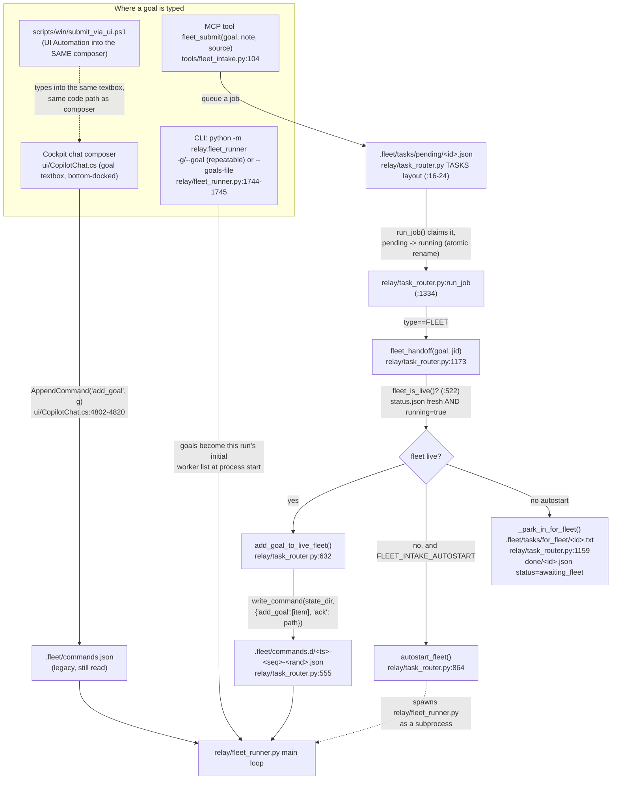
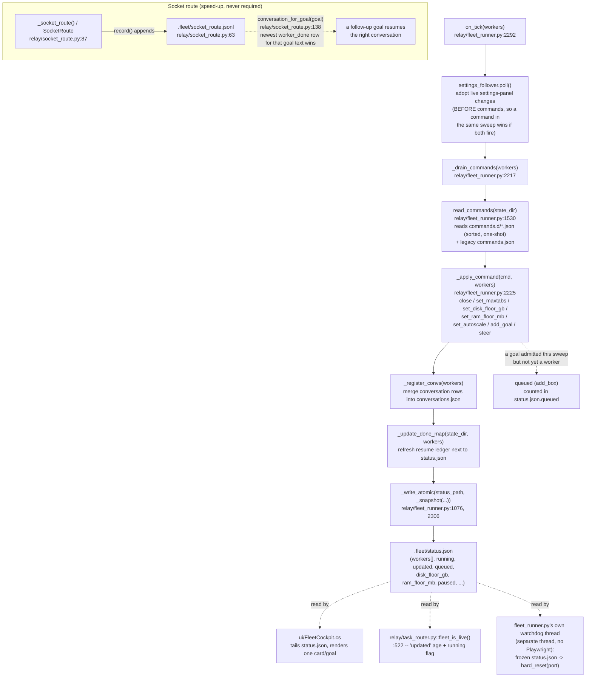
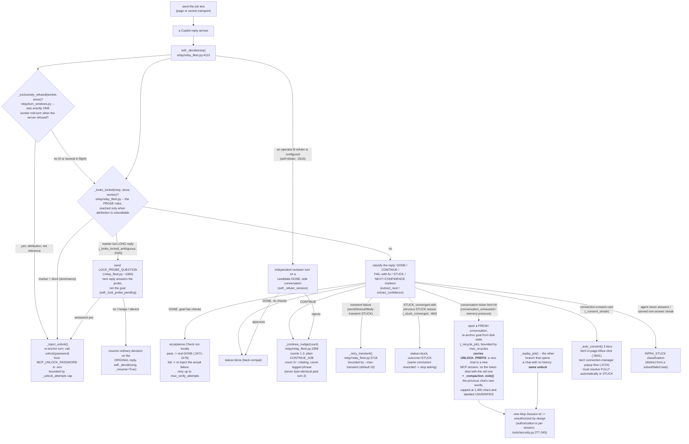
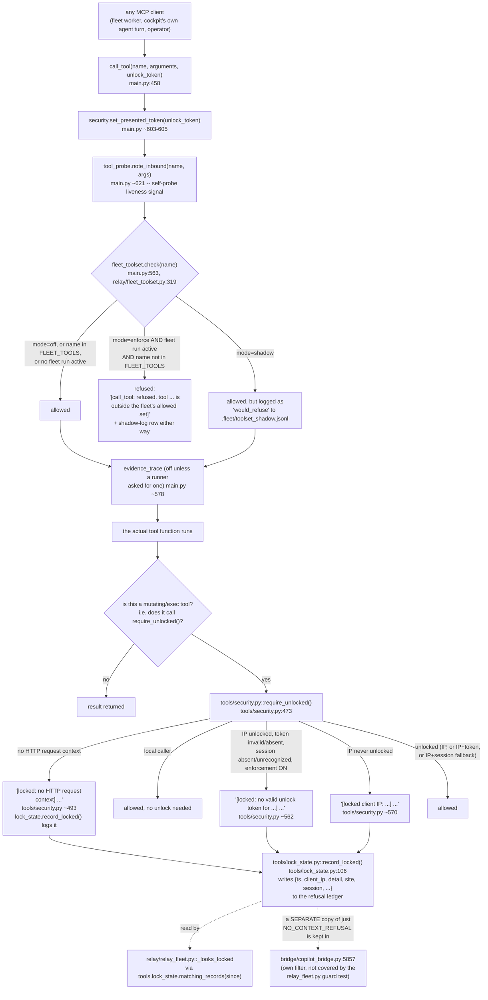
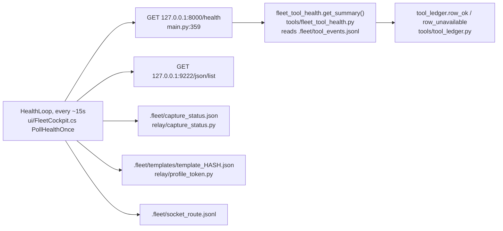

# System flow map

What actually moves when a goal runs, traced to source. Every box below names a real
file; every arrow is something the code does, not something it was meant to do. `<repo>`
is this checkout's root. Citations are `file:line` as of 2026-09-15 — they will drift,
which is exactly the problem [`fact_duplication_ledger.md`](fact_duplication_ledger.md)
and the [staying-current](#staying-current) section at the end of this file are for.

Split into four diagrams by concern, because one picture covering intake through a
worker's recovery branches stops being readable at a glance:

1. [Intake](#1-intake--how-a-goal-gets-in) — how a goal reaches the machine
2. [Coordinator sweep](#2-coordinator-sweep) — `relay/fleet_runner.py`'s tick
3. [One worker's turn](#3-one-workers-turn-cycle) — `relay/relay_fleet.py`'s decision loop
4. [The tool gateway](#4-the-mcp-tool-gateway) — `main.py`'s `call_tool` and its gates

A fifth section lists the [surfaces](#5-surfaces--what-each-ui-reads-and-writes) (the two
WPF apps) and what files each one touches, since that mapping is itself a duplicated fact.

---

## 1. Intake — how a goal gets in

Four doors, one destination. All but the CLI end up going through
`relay/task_router.py`'s `for_fleet` handoff or the running fleet's command channel.



Notes grounded in source:

- `fleet_submit` never runs anything itself — it only writes the job file
  (`tools/fleet_intake.py:2-35` docstring). Whether the goal becomes a run is
  `relay/task_router.py::run_job`'s decision.
- `add_goal_to_live_fleet` and the cockpit composer both end up writing the **same**
  on-disk command protocol (`{"add_goal": [...]}` items, consumed by
  `relay/fleet_runner.py::read_commands`), but through two different files
  (`commands.d/*.json` vs the legacy `commands.json`) and two different runtimes
  (Python vs the C# cockpit binary) — see row 5 of the fact ledger.
- `fleet_landing_confirmed(jid)` (`relay/task_router.py:616`) is the only way to tell
  "the sender said dispatched" from "the fleet actually read it": it checks for an ack
  file the reader drops the instant before consuming a command
  (`relay/fleet_runner.py:1530`, the `ACKS_DIR` receipt logic).

---

## 2. Coordinator sweep

`relay/fleet_runner.py` runs one Python process per fleet; every worker is driven inside
its `on_tick` closure, called each poll interval (`relay/fleet_runner.py:2292`).



Notes:

- `write_command` gives every command its own uniquely-named file specifically so no
  writer needs a lock — a shared `commands.json` used to be read-modify-written by every
  sender, and whichever wrote back second silently deleted the other's goal
  (`relay/task_router.py:555-575`, full rationale in the docstring). The legacy single
  file is kept readable **only** because `ui/CopilotChat.cs` and `ui/FleetCockpit.cs` are
  built separately and still write it (`relay/fleet_runner.py:1460-1462`).
  Note that `ui/CopilotChat.cs` also still does its own read-modify-write internally
  when merging into `commands.json` (`ui/CopilotChat.cs:4800-4819`, `AppendCommand`) —
  safe only because it is the file's one remaining writer, not because the race was fixed.
- The watchdog is armed **only** while a sweep is actually running, because it used to key
  off the `running` counter this same process had just written — a progress figure, not a
  liveness one (`relay/fleet_runner.py:2396-2400` area).

---

## 3. One worker's turn cycle

Each `RelayWorker` (a class inside `relay/relay_fleet.py`) drives one Copilot
conversation, one turn at a time, through `_decide`.



Notes:

- `_looks_locked` is deliberately two-part (a distinctive `[locked...]` marker **and**
  dominance by length) because a worker's own prose *about* the unlock API used to
  false-trip a looser check (`relay/relay_fleet.py:876-885`, the false-positive-fix
  comment). The fallback path (no marker, reply merely "talks about" being refused) reads
  `tools/lock_state.py`'s refusal ledger instead of guessing from prose alone — see the
  fact ledger for the currently-unread `session` field on that ledger.
- The CONTINUE-nudge escalation (`_continue_nudge`, `relay/relay_fleet.py:2399`) and its
  near-duplicate in `relay/copilot_autopilot_relay.py` (`_next_continue_job:531`,
  `_next_retry_job:513`) implement the *same contract* — "counts 1-2 unchanged, count 3+
  rotate and tag" — independently, for the fleet path and the single-conversation
  `run_relay()` path respectively. See the fact ledger, row 4.
- STUCK is not one outcome: `INFRA_STUCK` (sign-in wall / dead agent), plain `STUCK`
  (genuine dead end), and `VERIFY_FAILED` (DONE claimed, local checks disagree) are
  distinguished so a fleet-level retriage can treat them differently.
- **An attempted call that never arrived is not "did not finish".** When a reply writes an
  invocation out as prose instead of making it (`_tried_to_call_a_tool`,
  `relay/relay_fleet.py`), the worker is nudged about the route rather than about finishing,
  and two consecutive such turns end it as `INFRA_STUCK`. The streak is cleared by any reply
  without that markup, so the "連続" in the operator's message describes real consecutive
  turns. Deliberately does **not** also require an empty tool ledger: that conjunction was
  measured against the run it was written for and 19 calls had landed, which is why the
  first version never fired.

---

## 4. The MCP tool gateway

Every tool a fleet worker (or anyone else authenticated to the server) calls passes
through one function.



Notes:

- `fleet_toolset.check` is a **shadow-then-enforce** gate that cannot tell a fleet worker
  from the operator by identity (the server authenticates by API key only) — it infers
  "should this be restricted" purely from *whether an unattended run is in flight*
  (`relay/fleet_toolset.py::_fleet_run_active`, reading `tools/contract_gate.py`'s state).
  Default is `enforce` as of 2026-09-14 (`relay/fleet_toolset.py` mode() docstring).
- `require_unlocked()`'s three refusal strings are the single source of truth; everything
  downstream (the fleet's lock detector, the bridge's own filter) keeps its own copy of
  some or all of them. See the fact ledger, row 2.
- **Of those three, one is essentially the whole population.** `.fleet/lock_refusals.jsonl`,
  4,271 refusals since 2026-08-22: 4,258 are `[locked: no valid unlock token` (99.7%), 6 are
  the no-HTTP-context branch, 7 are the never-unlocked-IP branch. That branch means the IP
  *is* unlocked and holds tokens — 128 for this identity — and the call presented none.
  Until 2026-09-15 the cause was structural rather than agent forgetfulness: `_composed_prefix`
  is sliced off `composed_goal`, which is built *before* `_initial_job_with_unlock` prepends
  the unlock, so both branches that open a chat with no history rebuilt it without one.
  Measured on run `r6aa92e5a`: one worker, 34 minutes, 4 distinct MCP sessions, 3 refusals,
  all of them the brand-new-session case and none an expiry. Recovery was not reliable —
  of 518 refusals whose session was recorded, 453 never saw a successful `unlock()` in that
  session again. Guarded by
  `relay/test_a_fresh_conversation_is_a_locked_conversation.py`.

---

## 5. Surfaces — what each UI reads and writes

Both cockpit windows are separately built C# binaries
(`ui/build_cockpit.bat`; see `ui/FleetCockpit.cs:1-14` header comment) that read/write the
same `.fleet/` directory the Python side owns, with no shared schema definition between
the two languages.

| File | `ui/FleetCockpit.cs` | `ui/CopilotChat.cs` |
|---|---|---|
| `.fleet/status.json` | reads (tails it every poll to render worker cards) | — |
| `.fleet/commands.json` | writes (`_commandsPath`, `FleetCockpit.cs:995`) — release/stop/knob changes | writes (`AppendCommand`, `CopilotChat.cs:4802`) — `add_goal`, `steer` |
| `.fleet/history.json` | reads/writes | — |
| `.fleet/open.json` | reads/writes | — |
| `.fleet/conversations.json` | reads/writes | reads/writes (own conversation list) |
| `.fleet/cockpit_hidden.json`, `cockpit_resume_dismissed.json`, `history_cleared.jsonl` | reads/writes | — |
| `.fleet/transcripts/<run>_a<agent>_w<N>.jsonl[.gz]` | — | reads (merged glob over `*.jsonl` + `*.jsonl.gz`, `CopilotChat.cs:1005-1012`; suffix-matched per worker, `CopilotChat.cs:1043-1055`) |
| `.fleet/socket_route.jsonl` | — | not read directly (goes through `resume_conv` / `follow_up_to` on the goal item instead, see `CopilotChat.cs:4855-4867`) |

---

## 6. The health strip — what each dot is allowed to claim

Six dots along the top of `ui/FleetCockpit.cs`. **A general user looks only here and decides
from it**, so the standard is not "usually right": a dot must never assert something it has
not established, and "I do not know" must have somewhere to go. Every row below was wrong in
at least one of those two ways on 2026-09-16 and is recorded with what it rests on now.



| # | dot | green means, and on what evidence | the third state |
|---|---|---|---|
| 0 | server | `/health` answered AND the running process is on code the checkout still has (`main.py::_server_identity`). A moved HEAD alone is not enough: when the SHAs differ it asks `_watched_code_changed()`, so a docs- or cockpit-only commit stays green and only a change under `tools/deploy_freshness.WATCHED` turns it amber | amber on `server_code: "stale"`, or 3+ auth failures in 10 min. **The count is the alarm, not the evidence**: `tools/auth_stats.recent_rejections()` keeps each rejection with its path and user agent past the window, and `scripts/status.py` prints them — the IP alone cannot tell two callers apart, because the devtunnel host forwards from localhost and every caller reads as 127.0.0.1 |
| 1 | tunnel | a 200 through the tunnel origin **whose `server_pid` equals the local one** — reaching *a* server is not reaching *this* one | amber when `MCP_TUNNEL_URL` is unset; amber when the pid differs |
| 2 | edge | `:9222` answered **and** `/json/list` contains `_agentMarkerId`, the `T_`/`P_` id from `MCP_FLEET_AGENT_URL` — not merely the m365 domain, which the default-Copilot fallback also satisfies | falls back to the domain only when no marker is configured; separate message for "no run", which is not the same as "a socket-route run drives no tabs" |
| 3 | sign-in | an `ok` capture, token not expired, **and** the record no older than `SIGNIN_EVIDENCE_MAX_AGE_S` (5,400s = 1.4 measured token lifetimes) | grey when idle with no record, or an old record, or an expired token — three distinct messages |
| 4 | agent | a cached template for **this** surface, younger than `TEMPLATE_MAX_AGE_S`, whose `query.gptId` is non-empty. The cap is a copy of `relay/profile_token.py`'s and a test fails if it ever exceeds it | amber when the route record is unreadable, when no capture exists yet, and when only another surface's `gpt_id` is known |
| 5 | tool | `fleet_tool_ok` from the ledger, read through `row_ok`, and only from a `/health` body less than 60s old | **grey** when there is no evidence: no calls in 15 min, or every recent call was `unavailable`/`skipped` — an unattended machine is not a broken one |

**The rule the ledger enforces underneath dot 5** (`tools/tool_ledger.py`): a tool here
reports failure by *returning* it, so "the function returned" was never a verdict.
`[<name> error:`, `timeout`, `failed`, `refused` and `[locked` are failures;
`[<name> skipped:`/`aborted:`/`unavailable:` are **neither** — a skip says nothing about
whether the path works, and counting it green also reset the consecutive-failure streak;
`[stdout]`/`[stderr]` are successes, because a process that ran and printed an error is a
working tool path reporting a failing command.

### What must be updated here

- **A new dot, or a new branch on an existing one**: add or amend its row, and say what the
  third state is. A dot with only green and red is itself the finding.
- **A new word a tool uses to report an outcome**: `tools/test_a_new_way_to_say_failed_must_be_classified.py`
  fails when two or more modules agree on a word the ledger does not classify. Decide what
  it means there, then update the paragraph above.
- **Any threshold in the table**: the numbers are measurements, not preferences. If one
  changes, the measurement behind it has to change first.

---

## Staying current

This map is only as good as its last verification pass. What must be updated, and when:

- **Any new command verb** consumed in `relay/fleet_runner.py::_apply_command`
  (`relay/fleet_runner.py:2225`) that a UI writes: add it to the table's implicit list in
  §2 and to the fact ledger if a second writer could plausibly grow the same key.
- **Any new file under `.fleet/`** that either cockpit reads or writes: add a row to the
  §5 table. This is the cheapest single check to keep honest — see the automated guard
  below.
- **A change to `_looks_locked`, `LOCKED_MARKERS`, or `tools/security.py`'s refusal
  strings**: re-read §3's lock-detection notes and the fact ledger's row 2/3; the existing
  guard test only covers `relay/relay_fleet.py`, not `bridge/copilot_bridge.py`.
- **A rename of any file cited above** (this happened today, elsewhere in `tools/`: a
  window-hit-testing script was renamed to `tools/window_probe.py`): every `file:line`
  citation in this document and in
  `fact_duplication_ledger.md` needs re-checking, not just the renamed file's own callers.

**Automated staleness check**: `tests/test_flow_map_docs_name_files_that_exist.py` parses
both this file and `fact_duplication_ledger.md` for repo-relative file paths and fails if
any named file no longer exists. It catches a renamed/deleted file; it cannot catch a
diagram that is still wrong about what a file *does* — that half still needs a human
re-read. Run it with:

```
python -m pytest tests/test_flow_map_docs_name_files_that_exist.py -q
```
